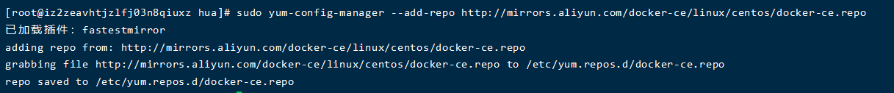
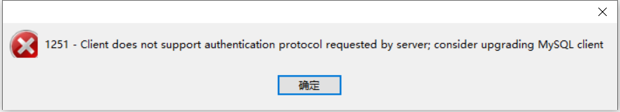

	环境：centos操作系统


## 安装python3.7.0环境

```spreadsheet
[root@aliyun /]# tar -zxf Python-3.7.0.tgz

[root@aliyun /]# cd Python-3.7.0

[root@aliyun /]# yum install zlib-devel bzip2-devel openssl-devel ncurses-devel sqlite-devel readline-devel tk-devel gdbm-devel libpcap-devel xz-devel

[root@aliyun /]# yum -y install libffi-devel

[root@aliyun /]# yum install openssl-devel bzip2-devel expat-devel gdbm-devel readline-devel sqlite-devel gcc gcc-c++ openssl-devel

[root@aliyun /]# ./configure

[root@aliyun /]# make

[root@aliyun /]# make install
```


## 安装docker

```shell
# 首先更新 yum 源
[root@aliyun /]# sudo yum update

# 删除原来的docker，如果原来没有安装过，就不用删除了
[root@aliyun /]# sudo yum remove docker \
>                  docker-client \
>                  docker-client-latest \
>                  docker-common \
>                  docker-latest \
>                  docker-latest-logrotate \
>                  docker-logrotate \
>                  docker-selinux \
>                  docker-engine-selinux \
>                  docker-engine
```

```shell
# 在问度娘的时候，看到都要安装下面这个，也就安装了，应该没什么坏处
[root@aliyun /]# sudo yum install -y yum-utils device-mapper-persistent-data lvm2

# 设置阿里云的源
[root@aliyun /]# sudo yum-config-manager --add-repo http://mirrors.aliyun.com/docker-ce/linux/centos/docker-ce.repo
```



下面开始安装docker

```shell
# 查看docker的版本
[root@aliyun /]# yum list docker-ce --showduplicates | sort -r
已加载插件：fastestmirror, product-id, search-disabled-repos, subscription-manager
可安装的软件包
This system is not registered with an entitlement server. You can use subscription-manager to register.
Loading mirror speeds from cached hostfile
docker-ce.x86_64            3:19.03.8-3.el7                     docker-ce-stable
docker-ce.x86_64            3:19.03.7-3.el7                     docker-ce-stable
docker-ce.x86_64            3:19.03.6-3.el7                     docker-ce-stable
docker-ce.x86_64            3:19.03.5-3.el7                     docker-ce-stable
docker-ce.x86_64            3:19.03.4-3.el7                     docker-ce-stable
...
```

在这里我们使用最新的版本就可以了，默认安装的就是最新。

```shell
[root@aliyun /]# yum -y install docker

# 如果提示你需要使用 --skip-broken ，那你就在命令后面加上 --skip-broken
```

当然也可以安装指定版本的docker。

```shell
# 指定版本为 ： 18.06.3.ce-3.el7 

# 安装： 
[root@aliyun /]# yum -y install docker-ce-18.06.3.ce-3.el7 

# 查看版本
[root@aliyun /]# docker -v
Docker version 1.13.1, build 64e9980/1.13.1
```

到这里就安装成功了。

下面是docker的一些命令，后面都会用到

```shell
# 运行docker
[root@aliyun /]# systemctl start docker

# 停止docker
[root@aliyun /]# systemctl stop docker

# 查看本地镜像
[root@aliyun /]# docker images
REPOSITORY          TAG                 IMAGE ID            CREATED             SIZE

# 查看所有容器的状态
[root@aliyun /]# docker ps -a
CONTAINER ID        IMAGE               COMMAND             CREATED             STATUS              PORTS               NAMES

# 查看当前正在运行的容器
[root@aliyun /]# docker ps
CONTAINER ID        IMAGE               COMMAND             CREATED             STATUS              PORTS               NAMES

# 查看docker是否运行成功
[root@aliyun /]# systemctl status docker
```


```shell
# 启动/停止某个容器
[root@aliyun /]# docker start/stop id/name /bin/bash

# 删除某个容器
[root@aliyun /]# docker rm id/name 

# 强制删除某个容器
[root@aliyun /]# docker rm -f id/name 

# 删除某个镜像
[root@aliyun /]# docker rmi id/name 
```


### docker拉取镜像

可以直接拉取网上做好的镜像，在心里谢过各位大佬以后，手上就不客气了...


#### docker之centos镜像

```shell
# 查找镜像
[root@aliyun ~]# docker search mysql
INDEX       NAME                                        DESCRIPTION                                     STARS     OFFICIAL   AUTOMATED
docker.io   docker.io/mysql                             MySQL is a widely used, open-source relati...   9482      [OK]       
docker.io   docker.io/mariadb                           MariaDB is a community-developed fork of M...   3427      [OK]       
docker.io   docker.io/mysql/mysql-server                Optimized MySQL Server Docker images. Crea...   695                  [OK]
docker.io   docker.io/centos/mysql-57-centos7           MySQL 5.7 SQL database server                   75                   
...


# 在这里我拉取的是兄长随手做着玩的一个centos系统镜像...
[root@aliyun hua]# docker search lixinghua
INDEX       NAME                              DESCRIPTION   STARS     OFFICIAL   AUTOMATED
docker.io   docker.io/lixinghua/base_centos                 0                    

# 拉取镜像，可以看到命令是 docker pull [NAME]
[root@aliyun hua]# docker pull docker.io/lixinghua/base_centos
Using default tag: latest
Trying to pull repository docker.io/lixinghua/base_centos ... 
latest: Pulling from docker.io/lixinghua/base_centos
ab5ef0e58194: Downloading [====>                                              ] 6.413 MB/75.78 MB
ddb8d88277d9: Downloading [=>                                                 ] 4.244 MB/151.3 MB
67b026c9dda8: Downloading [===============>                                   ] 7.722 MB/24.5 MB
9345065e3dd4: Waiting 

# 可以用命令查看下载好的镜像，1.17G大概用了半分钟
[root@aliyun hua]# docker images
REPOSITORY                        TAG                 IMAGE ID            CREATED             SIZE
docker.io/lixinghua/base_centos   latest              1322bd0fef2c        5 months ago        1.17 GB

# 用tag命令给镜像打上标签，并用images命令查看
[root@aliyun hua]# docker tag docker.io/lixinghua/base_centos:latest docker.io/lixinghua/base_centos:mysql

[root@aliyun hua]# docker images
REPOSITORY                        TAG                 IMAGE ID            CREATED             SIZE
docker.io/lixinghua/base_centos   latest              1322bd0fef2c        5 months ago        1.17 GB
docker.io/lixinghua/base_centos   centos              1322bd0fef2c        5 months ago        1.17 GB

```

在这里我们发现，我们打了一个标签，但是出现了两个，所以，我们可以把原来的删掉，命令如下：

```shell
# 删除镜像
[root@aliyun ~]# docker rmi docker.io/lixinghua/base_centos:latest
Untagged: docker.io/lixinghua/base_centos:latest

# 再次查看镜像，已删除多余镜像
[root@aliyun ~]# docker images
REPOSITORY                        TAG                 IMAGE ID            CREATED             SIZE
docker.io/lixinghua/base_centos   centos              1322bd0fef2c        5 months ago        1.17 GB

# 创建一个容器并运行
[root@aliyun ~]# docker run -t -i docker.io/lixinghua/base_centos:centos /bin/bash
[root@cc214d175b8c /]# 

# 退出一个容器
[root@cc214d175b8c /]# exit
exit
[root@aliyun ~]# 

# 列出当前正在运行的容器
[root@aliyun ~]# docker ps -s
CONTAINER ID        IMAGE                             COMMAND             CREATED             STATUS              PORTS               NAMES               SIZE
cc214d175b8c        docker.io/lixinghua/base_centos   "/bin/bash"         35 hours ago        Up About a minute                       blissful_minsky     606 B (virtual 1.17 GB)


# 列出当前所有的容器
[root@aliyun ~]# docker ps -a
```


```shell
# 进入容器	（注意：我试了一下，如果最后不加上/bin/bash ，进不去，但是我看到网上好像有人可以，目前还不知道是什么问题）
[root@aliyun ~]# docker exec -it cc214d175b8c /bin/bash
[root@cc214d175b8c /]# 

# 停止一个容器的运行
[root@aliyun ~]# docker stop cc214d175b8c
cc214d175b8c

# 运行一个已存在的容器
[root@aliyun ~]# docker start cc214d175b8c
cc214d175b8c

```


#### docker之mysql镜像

docker中的mysql镜像的运行方法，跟centos镜像不一样

命令如下：

```shell
[root@aliyun hua]# docker run -d -p 3306:3306 --privileged=true -v /docker/mysql/conf/my.cnf:/etc/my.cnf -v /docker/mysql/data:/var/lib/mysql -e MYSQL_ROOT_PASSWORD=123456 --name mysql docker.io/mysql:mysql --character-set-server=utf8mb4 --collation-server=utf8mb4_general_ci
d00c9f81cd6e3333ac234fdbdcc16c69f224ad5addadf170042f753e32a8af6e
```

- run　run 是运行一个容器
- -d　 表示后台运行
- -p　　表示容器内部端口和服务器端口映射关联
- --privileged=true　设值MySQL 的root用户权限, 否则外部不能使用root用户登陆
- -v /docker/mysql/conf/my.cnf:/etc/my.cnf 将服务器中的my.cnf配置映射到docker中的/docker/mysql/conf/my.cnf配置
- -v /docker/mysql/data:/var/lib/mysql　　同上,映射数据库的数据目录, 避免以后docker删除重新运行MySQL容器时数据丢失
- -e MYSQL_ROOT_PASSWORD=123456　　　设置MySQL数据库root用户的密码
- --name mysql　　　　 设值容器名称为mysql
- mysql:5.7　　表示从docker镜像mysql:5.7中启动一个容器
- --character-set-server=utf8mb4 --collation-server=utf8mb4_general_ci 设置数据库默认编码


​	记得开启远程服务的权限。**还有，如果是阿里云的服务器，记得开放3306端口，否则连接不上的！！！**

​	如果不开启远程服务，则会出现以下的错误。



```shell
# MySQL数据库开启远程连接权限，否则也会出现上面的错误
mysql> GRANT ALL ON *.* TO 'root'@'%';
Query OK, 0 rows affected (0.00 sec)

# 123456是mysql数据库的密码
mysql> ALTER USER 'root'@'%' IDENTIFIED WITH mysql_native_password BY '123456';
Query OK, 0 rows affected (0.01 sec)

```

​	 因为 mysql8.0 版本的加密方式不同，所以如果不更改加密方式，也可能会出现出现以上的错误（我没有试过5.7版本的，但是应该不用改），所以可以改一下 mysql 的加密方式：

```shell
二、更改mysql的加密方式：
mysql> ALTER USER 'root'@'localhost' IDENTIFIED BY 'password' PASSWORD EXPIRE NEVER;
Query OK, 0 rows affected (0.10 sec)

三、更改root帐户密码：比如 123456
mysql> ALTER USER 'root'@'localhost' IDENTIFIED WITH MYSQL_NATIVE_PASSWROD BY '123456';
Query OK, 0 rows affected (0.02 sec)
```


#### docker之redis镜像

​	个人是用配置文件启动的，并保持数据持久化，所以需要提前准备好配置文件 redis.conf 。

```shell
# 拉取镜像
[root@aliyun /]# docker pull redis

# 启动镜像 (redis.conf配置文件见E:\编程笔记\服务器篇\配置文件\redis配置文件\6379.conf)
[root@aliyun /]# docker run -it --name redis -p 6379:6379 -v $PWD/docker/redis/conf/redis.conf:/etc/redis/redis.conf -v $PWD/docker/redis/data:/data docker.io/redis:redis redis-server /etc/redis/redis.conf --appendonly yes
1:C 01 Jul 2020 15:52:32.947 # oO0OoO0OoO0Oo Redis is starting oO0OoO0OoO0Oo
1:C 01 Jul 2020 15:52:32.947 # Redis version=6.0.5, bits=64, commit=00000000, modified=0, pid=1, just started
1:C 01 Jul 2020 15:52:32.947 # Configuration loaded
                _._                                                  
           _.-``__ ''-._                                             
      _.-``    `.  `_.  ''-._           Redis 6.0.5 (00000000/0) 64 bit
  .-`` .-```.  ```\/    _.,_ ''-._                                   
 (    '      ,       .-`  | `,    )     Running in standalone mode
 |`-._`-...-` __...-.``-._|'` _.-'|     Port: 6379
 |    `-._   `._    /     _.-'    |     PID: 1
  `-._    `-._  `-./  _.-'    _.-'                                   
 |`-._`-._    `-.__.-'    _.-'_.-'|                                  
 |    `-._`-._        _.-'_.-'    |           http://redis.io        
  `-._    `-._`-.__.-'_.-'    _.-'                                   
 |`-._`-._    `-.__.-'    _.-'_.-'|                                  
 |    `-._`-._        _.-'_.-'    |                                  
  `-._    `-._`-.__.-'_.-'    _.-'                                   
      `-._    `-.__.-'    _.-'                                       
          `-._        _.-'                                           
              `-.__.-'                                               

1:M 01 Jul 2020 15:52:32.949 # WARNING: The TCP backlog setting of 511 cannot be enforced because /proc/sys/net/core/somaxconn is set to the lower value of 128.
1:M 01 Jul 2020 15:52:32.949 # Server initialized
1:M 01 Jul 2020 15:52:32.949 # WARNING overcommit_memory is set to 0! Background save may fail under low memory condition. To fix this issue add 'vm.overcommit_memory = 1' to /etc/sysctl.conf and then reboot or run the command 'sysctl vm.overcommit_memory=1' for this to take effect.
1:M 01 Jul 2020 15:52:32.949 # WARNING you have Transparent Huge Pages (THP) support enabled in your kernel. This will create latency and memory usage issues with Redis. To fix this issue run the command 'echo never > /sys/kernel/mm/transparent_hugepage/enabled' as root, and add it to your /etc/rc.local in order to retain the setting after a reboot. Redis must be restarted after THP is disabled.
1:M 01 Jul 2020 15:52:32.949 * Ready to accept connections

```

​	**（重点）命令解释：**

- **-i :** 以交互模式运行容器，通常与 -t 同时使用；

- **-t :** 为容器重新分配一个伪输入终端，通常与 -i 同时使用；

- **--name :**为容器指定一个名字；

- **-p :**将宿主机上的端口映射到容器里，如果是阿里云的服务器，记得开放端口；

- **-v :**将宿主机的文件挂载到容器里，这里是将 redis.conf 和 data 挂载进去了，否则无法配置；

- **docker.io/redis:redis :**指定用于启动的镜像，前后用空格与前面的命令隔开，位置可随意；

- **redis-server /etc/redis/redis.conf  :**这个是关键配置，让redis不是无配置启动，而是按照 redis.conf 里的配置启动；

- **--appendonly yes :**redis启动后数据持久化；

  

​	**踩过的坑：**我在网上搜到的命令好多没有加 -it 这个参数，所以创建容器后发现，无法开启容器，当然也无法进入容器，其实到目前为止，我还不确定是不是因为 -it 这个参数，但是我对比了命令，好像也只有这个参数不一样，所以我只能将问题归结到参数 -it 上。

​	这个时候我们已经创建好了容器，进入容器并测试，就会发现需要输入密码了。

```shell
# 进入容器
[root@aliyun ~]# docker exec -it redis /bin/bash

# 启动 redis 自带的客户端
root@ef9d53c0b84a:/# redis-cli

# 测试：创建 key:value 为 foo:bar (如果报错，需要输入密码，则说明成功)
127.0.0.1:6379> set foo bar
(error) NOAUTH Authentication required.

# 输入密码
127.0.0.1:6379> auth 123456
OK

# 测试：创建key:value
127.0.0.1:6379> set foo bar
OK

# 查询
127.0.0.1:6379> get foo
"bar"
```

​	到此，redis 容器创建成功。


#### docker之nginx

```shell
# 拉取镜像
[root@aliyun ~]# docker pull nginx
Using default tag: latest
Trying to pull repository docker.io/library/nginx ... 
latest: Pulling from docker.io/library/nginx
8559a31e96f4: Already exists 
8d69e59170f7: Pull complete 
3f9f1ec1d262: Pull complete 
d1f5ff4f210d: Pull complete 
1e22bfa8652e: Pull complete 
Digest: sha256:21f32f6c08406306d822a0e6e8b7dc81f53f336570e852e25fbe1e3e3d0d0133
Status: Downloaded newer image for docker.io/nginx:latest

```


### docker 镜像制作 

```shell
# centos为提交的描述内容，0622760f3e96为容器的CONTAINER ID
[root@aliyun hua]# docker commit -m 'centos' 0622760f3e96
sha256:dd87d0bdb491d982d2d32055016f13f6432e052c194c5f7622d9007176718881

# 可以看到镜像已经制作完成
[root@aliyun hua]# docker images
REPOSITORY                           TAG                 IMAGE ID            CREATED             SIZE
<none>                              <none>              dd87d0bdb491       3 minutes ago     1.92 GB

# 为镜像命名打标签
[root@aliyun hua]# docker tag dd87d0bdb491 huafire/centos:centos
[root@aliyun hua]# docker images
REPOSITORY                           TAG                 IMAGE ID            CREATED             SIZE
huafire/centos                    centos             dd87d0bdb491        6 minutes ago     1.92 GB

```


### docker 镜像上传

​	我上传的是阿里云的 docker hub 镜像站点：https://cr.console.aliyun.com/cn-hangzhou/instances/repositories

​	阿里云的 docker 镜像文档：https://help.aliyun.com/document_detail/60743.html?spm=a2c4g.11174283.6.550.6a2d4541lMLQGt

​	（阿里云的 docker hub 账号是另外申请的，容器镜像服务里，另外，创建好镜像仓库以后，可以看到管理。点进入就可以看到操作指南。）

​	**注意：记得用阿里云的加速器，不然速度会很感人**

```shell
# 登录阿里云，username= 后面是自己的阿里云的名字，然后输入密码
[root@aliyun hua]# docker login --username=xxx registry.cn-beijing.aliyuncs.com
Password: 
Login Succeeded

# 按照阿里云的文档说明来命名镜像
[root@aliyun hua]# docker tag dd87d0bdb491 registry.cn-beijing.aliyuncs.com/huafire/huafire:centos

# 可以看到命名成功了		镜像名称=registry.cn-beijing.aliyuncs.com/huafire/huafire
[root@aliyun hua]# docker images
REPOSITORY                   TAG                 IMAGE ID            CREATED             SIZE
镜像名称		        	 centos              dd87d0bdb491        3 hours ago         1.92 GB

# 推向阿里云
[root@aliyun hua]# docker push registry.cn-beijing.aliyuncs.com/likanghua/likanghua:centos
The push refers to a repository [registry.cn-beijing.aliyuncs.com/likanghua/likanghua]
8330ff0b410f: Pushed 
0683de282177: Pushed 
centos: digest: sha256:cdac6c3308e08f2101258bf17c12298ddc545ae034c2fa0768a1b824bd044c18 size: 742

# 从阿里云拉取镜像
[root@aliyun hua]# docker pull registry.cn-beijing.aliyuncs.com/likanghua/likanghua:centos
Trying to pull repository registry.cn-beijing.aliyuncs.com/likanghua/likanghua ... 
centos: Pulling from registry.cn-beijing.aliyuncs.com/likanghua/likanghua
Digest: sha256:cdac6c3308e08f2101258bf17c12298ddc545ae034c2fa0768a1b824bd044c18
Status: Image is up to date for registry.cn-beijing.aliyuncs.com/likanghua/likanghua:centos

```


### docker 常用命令总结

#### 启动，关闭docker

```shell
# 运行docker
[root@aliyun /]# systemctl start docker

# 停止docker
[root@aliyun /]# systemctl stop docker
```

#### 查看镜像和容器

```shell
# 查看本地镜像
[root@aliyun /]# docker images

# 查看所有容器的状态
[root@aliyun /]# docker ps -a

# 查看当前正在运行的容器
[root@aliyun /]# docker ps

```

#### 查找并拉取镜像

```shell
# 查找镜像
[root@aliyun ~]# docker search mysql

# 拉取镜像，可以看到命令是 docker pull [NAME]
[root@aliyun hua]# docker pull docker.io/lixinghua/base_centos
```

#### 给镜像打标签

```shell
# 用tag命令给镜像打上标签
[root@aliyun hua]# docker tag docker.io/lixinghua/base_centos:latest docker.io/lixinghua/base_centos:mysql
```

#### 创建容器

```shell
# 创建一个容器并运行
[root@aliyun ~]# docker run -t -i docker.io/lixinghua/base_centos:centos /bin/bash

# 这个是创建并运行MySQL容器，需要映射端口，上文有详细的命令解释
[root@aliyun hua]# docker run -d -p 3306:3306 --privileged=true -v /docker/mysql/conf/my.cnf:/etc/my.cnf -v /docker/mysql/data:/var/lib/mysql -e MYSQL_ROOT_PASSWORD=123456 --name mysql docker.io/mysql:mysql --character-set-server=utf8mb4 --collation-server=utf8mb4_general_ci
```

#### 进入、退出容器

```shell
# 进入容器	（注意：我试了一下，如果最后不加上/bin/bash ，进不去，但是我看到网上好像有人可以，目前还不知道是什么问题）
[root@aliyun ~]# docker exec -it cc214d175b8c /bin/bash
[root@cc214d175b8c /]# 

# 退出一个容器
[root@cc214d175b8c /]# exit
```

#### 停止、运行容器

```shell
# 停止一个容器的运行
[root@aliyun ~]# docker stop cc214d175b8c
cc214d175b8c

# 运行一个已存在的容器
[root@aliyun ~]# docker start cc214d175b8c
cc214d175b8c
```

#### 将本地文件上传到容器的指定目录中

```shell
[root@aliyun ~]#docker cp 本地文件路径 ID全称:容器路径
```

#### 删除容器和镜像

​	**注意：在删除镜像前要先删除容器，不然删除不了，会报错**

```shell
# 删除某个容器
[root@aliyun /]# docker rm id/name 

# 强制删除某个容器
[root@aliyun /]# docker rm -f id/name 

# 删除前的镜像
[root@aliyun hua]# docker images
REPOSITORY                        TAG                 IMAGE ID            CREATED             SIZE
docker.io/mysql                   latest              a7a67c95e831        2 weeks ago         541 MB
docker.io/lixinghua/base_centos   latest              1322bd0fef2c        5 months ago        1.17 GB
docker.io/lixinghua/base_centos   centos              1322bd0fef2c        5 months ago        1.17 GB

# 删除镜像	[REPOSITORY]:[TAG]
[root@aliyun hua]# sudo docker rmi docker.io/lixinghua/base_centos:latest
Untagged: docker.io/lixinghua/base_centos:latest

# 删除后的镜像
[root@aliyun hua]# docker images
REPOSITORY                        TAG                 IMAGE ID            CREATED             SIZE
docker.io/mysql                   latest              a7a67c95e831        2 weeks ago         541 MB
docker.io/lixinghua/base_centos   mysql               1322bd0fef2c        5 months ago        1.17 GB


```

#### 重命名容器

```shell
# 重命名容器
[root@aliyun ~]# docker rename musing_mestorf mysql
```


#### 登录阿里云

```shell
# 登录阿里云，username= 后面是自己的阿里云的名字，然后输入密码
[root@aliyun hua]# docker login --username=xxx registry.cn-beijing.aliyuncs.com
Password: 
Login Succeeded

```

#### 制作镜像并推出

```shell
# centos为提交的描述内容，0622760f3e96为容器的CONTAINER ID
[root@aliyun hua]# docker commit -m 'centos' 0622760f3e96
sha256:dd87d0bdb491d982d2d32055016f13f6432e052c194c5f7622d9007176718881

# 按照阿里云的文档说明来命名镜像
[root@aliyun hua]# docker tag dd87d0bdb491 registry.cn-beijing.aliyuncs.com/huafire/huafire:centos

# 推向阿里云
[root@aliyun hua]# docker push registry.cn-beijing.aliyuncs.com/likanghua/likanghua:centos
```


​	总结：docker 对于我们是必备技能之一，但是在快速部署大量服务器的时候，dockerfile应该更好用一些，但是作为初学者，还是先熟练运用 docker 镜像和容器更好一些，同时也建议百度一下 docker ，看看原理可以更好的帮助我们学习，dockerfile 的用法以后也会详细的讲到，上文如果有不妥之处，敬请斧正！