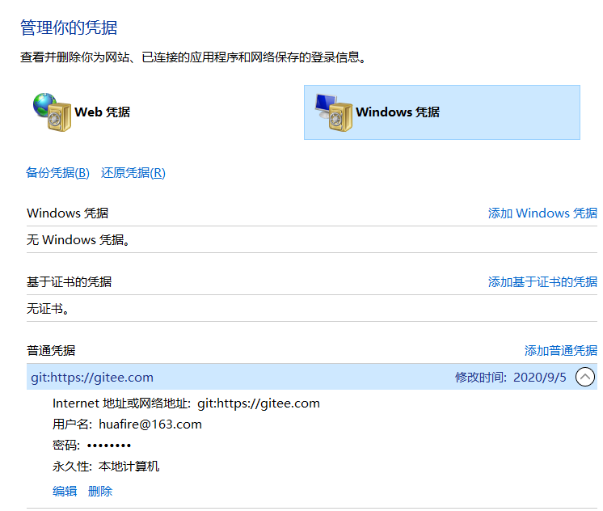

​	简单的说，git 是为了更方便的管理代码，我们可以通过 git 来管理自己的代码。

### 	git 工作命令(个人理解)：

​	先简单的说一下个人对 git 工作的方式，如果我们想要将代码上传到 GitHub 或者 Gitee 上，我们先要在本地建立起一个仓库，也就是下面这条命令：

```bash
git init
```

​	然后我们要将想要提交的代码加入缓存区，也就相当于是将想提交的代码先放到本地的仓库中，命令如下：

```bash
git add .
```

​	我就默认将这个文件夹里所有的代码都提交了，提交到本地仓库以后，我们开始连接到自己想要提交的仓库，命令：

```bash
git remote add origin https://...
```

​	然后我们开始提交我们本次提交的信息的注释，命令如下：(注意：如果我们是第一次提交，则会让我们填写邮箱和用户名，我们按照命令的提示，直接输入就可以了)

```bash
git commit -m "提交信息"
```

​	与远程仓库建立起联系后，为了解决远程仓库和本地的冲突，要先将远程仓库的代码拉取到本地，命令如下：

```bash
git pull --rebase origin master
```

​	将远程仓库的代码拉取到本地后，我们再将代码一起推到远程仓库上，命令如下：

```bash
git push -u origin master
```

​	**特别注意：这个时候，一般会让输入用户名和密码，注意！！！一定一定要输入正确，修改的时候，不太好修改，不修改的话，是会一直报错的！！！**


### 修改密码：

​	下面假设密码第一次输入错误，修改的时候，要先打开控制面板，点击用户账户。


​	然后点击管理 Windows 凭据。


​	然后我们就会看到如下界面，然后再点击编辑就可以了。




​	然后点击管理 Windows 凭据。


​	然后我们就会看到如下界面，然后再点击编辑就可以了。


### 命令总结：

​	下面是个人总结的一些平时常用的命令：

```bash
# 先进入到工作目录中，开始初始化仓库(在当前文件夹下生成一个 .git 文件夹)
E:\Test> git init

# 拷贝一份远程仓库，也就是下载一个项目(默认是当前文件夹，后面可以自己加文件夹例如 D:\Test)
E:\Hexo> git clone https://... D:\Test

# 添加文件到暂存区
E:\Hexo> git add .

# 添加 commit 注释
E:\Hexo> git commit -m "提交内容"

# 查看仓库当前的状态，显示有变更的文件
E:\Hexo> git status

# 远程仓库操作
E:\Hexo> git remote add origin https://...

# 下载远程代码并合并
E:\Hexo> git pull --rebase origin master

# 上传远程代码并合并
E:\Hexo> git push -u origin master
```


git 创建、查看、切换分支

```bash
# 创建分支，例如创建 test 分支
git branch test

# 查看分支
git branch

# 查看所有分支
git branch -a

# 切换分支，例如切换为 test 分支
git checkout test

# 删除分支，例如删除 test 分支
git branch -d test
```


