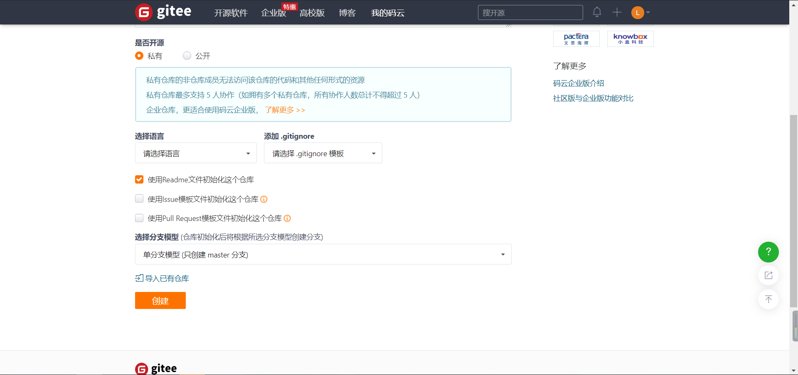

## 环境部署

​	首先要安装 git 和 nodejs，git 的安装可以直接在电脑管家里的软件管理直接安装，当然，也可以自己下载安装包安装，官网：https://git-scm.com/download/win ，同样的，nodejs 也可以直接在电脑管家里的软件管理安装，也可以自己下载安装包，官网：https://nodejs.org/en/ ， 会自动弹出是否下载。

​	github 和 gitee 都可以部署，各有优缺点。在 github 上部署的话，访问比较慢，毕竟是国外的，在 gitee 上部署的话，每次更新都需要自己手动点几下。

## 建立仓库

​	个人是在 gitee 上部署的，首先建立一个仓库。


​	**仓库名一定要是你 gitee 的昵称。**不要问我为什么，我不想回答...

​	选项按照下面就可以。



​	

## 本地运行

​	建立好仓库以后，在本地建立一个文件夹个人建立文件夹路径：E:\Hexo ，然后开始全局安装 hexo ，打开 cmd（注：这里也可以用 git bash ，都可以），命令如下：

```bash
# 全局安装hexo
E:\Hexo> npm install -g hexo
```

​	运行完这条命令以后，检查 hexo 是否可用：

```bash
E:\Hexo> hexo -v
```

​	如果可用，就会显示 hexo 的版本号，如果不能用，则会报错。如果没有报错，请忽视下面这一段。

​	我的就报错了，不是内部或者外部命令，不要慌，这个原因是没有加入环境变量，手动加上环境变量就ok了，我的 hexo 默认安装到 D:\program files\nodejs\node_cache 这个文件夹下面了，所以我们只要讲这个路径手动加到环境变量就ok了。注意：这个时候需要重新打开一个 cmd ，原来的 cmd 是没有刷新的。

​	hexo 可以用了以后：

```bash
# 先进入到我们刚刚建立的文件夹里，然后开始初始化项目
C:\Users\12136> E:
E:\> cd Hexo
E:\Hexo> hexo init

# 再编译工程，自动生成站点
E:\Hexo> hexo g

# 启动本地服务
E:\Hexo> hexo s
```

​	注：hexo g 和 hexo s 可以合并，写成一条命令： hexo g && hexo s

​	这个时候我们打开浏览器，输入网址：127.0.0.1:4000，就可以看到我们在本地的个人博客了。

​	

​	修改 _config.yml 配置文件

​	我们打开刚刚建立的 Hexo 文件夹，编辑 _config.yml 文件，直接找到最后

```
deploy:
  type: 
```

改成：

```
deploy:
  type: git
  repo: https://gitee.com/likanghua/likanghua.git #https://gitee.com/likanghua/likanghua.git为仓库地址
  branch: master
```

​	注意：

​	1、每个冒号后面都有一个空格。

​	2、repo 后面的地址是自己仓库的地址，如下图：


​	下面的过程就是我们上传到 gitee 仓库的过程了，肯定要用到 git 命令，所以总结了一下常用的几个 git 命令：

```bash
# 初始化仓库
E:\Hexo> git init

# 添加文件到暂存区
E:\Hexo> git add .

# 将暂存区内容添加到仓库中
E:\Hexo> git commit

# 拷贝一份远程仓库，也就是下载一个项目
E:\Hexo> git clone

# 查看仓库当前的状态，显示有变更的文件
E:\Hexo> git status

# 远程仓库操作
E:\Hexo> git remote

# 下载远程代码并合并
E:\Hexo> git pull

# 上传远程代码并合并
E:\Hexo> git push
```

## 上传到仓库

​	下面开始将我们已经在本地部署好的个人博客上传到 gitee 上：

```bash
# 初始化仓库
E:\Hexo>git init
Initialized empty Git repository in E:/Hexo/.git/

# 添加文件到暂存区
E:\Hexo>git add .
warning: LF will be replaced by CRLF in package.json.
The file will have its original line endings in your working directory

# 连接自己的仓库，其中 https://gitee.com/***/***.git 是自己的仓库
E:\Hexo>git remote add origin https://gitee.com/***/***.git

# 注意：第一次应该会让填写邮箱和仓库名
E:\Hexo>git commit -m "hexo初始化"
[master (root-commit) c49d245] hexo初始化
 93 files changed, 7127 insertions(+)
 create mode 100644 .gitignore
 create mode 100644 _config.yml
 create mode 100644 package-lock.json
 create mode 100644 package.json
 create mode 100644 scaffolds/draft.md
 create mode 100644 scaffolds/page.md
 create mode 100644 scaffolds/post.md
 create mode 100644 source/_posts/hello-world.md
 create mode 100644 themes/landscape/.gitignore
 create mode 100644 themes/landscape/Gruntfile.js
 create mode 100644 themes/landscape/LICENSE
 create mode 100644 themes/landscape/README.md
 create mode 100644 themes/landscape/_config.yml
 create mode 100644 themes/landscape/languages/de.yml
 create mode 100644 themes/landscape/languages/default.yml
 create mode 100644 themes/landscape/languages/es.yml
 create mode 100644 themes/landscape/languages/fr.yml
 create mode 100644 themes/landscape/languages/ja.yml
 create mode 100644 themes/landscape/languages/ko.yml
 create mode 100644 themes/landscape/languages/nl.yml
 create mode 100644 themes/landscape/languages/no.yml
 create mode 100644 themes/landscape/languages/pt.yml
 create mode 100644 themes/landscape/languages/ru.yml
 create mode 100644 themes/landscape/languages/zh-CN.yml
 create mode 100644 themes/landscape/languages/zh-TW.yml
 create mode 100644 themes/landscape/layout/_partial/after-footer.ejs
 create mode 100644 themes/landscape/layout/_partial/archive-post.ejs
 create mode 100644 themes/landscape/layout/_partial/archive.ejs
 create mode 100644 themes/landscape/layout/_partial/article.ejs
 create mode 100644 themes/landscape/layout/_partial/footer.ejs
 create mode 100644 themes/landscape/layout/_partial/gauges-analytics.ejs
 create mode 100644 themes/landscape/layout/_partial/google-analytics.ejs
 create mode 100644 themes/landscape/layout/_partial/head.ejs
 create mode 100644 themes/landscape/layout/_partial/header.ejs
 create mode 100644 themes/landscape/layout/_partial/mobile-nav.ejs
 create mode 100644 themes/landscape/layout/_partial/post/category.ejs
 create mode 100644 themes/landscape/layout/_partial/post/date.ejs
 create mode 100644 themes/landscape/layout/_partial/post/gallery.ejs
 create mode 100644 themes/landscape/layout/_partial/post/nav.ejs
 create mode 100644 themes/landscape/layout/_partial/post/tag.ejs
 create mode 100644 themes/landscape/layout/_partial/post/title.ejs
 create mode 100644 themes/landscape/layout/_partial/sidebar.ejs
 create mode 100644 themes/landscape/layout/_widget/archive.ejs
 create mode 100644 themes/landscape/layout/_widget/category.ejs
 create mode 100644 themes/landscape/layout/_widget/recent_posts.ejs
 create mode 100644 themes/landscape/layout/_widget/tag.ejs
 create mode 100644 themes/landscape/layout/_widget/tagcloud.ejs
 create mode 100644 themes/landscape/layout/archive.ejs
 create mode 100644 themes/landscape/layout/category.ejs
 create mode 100644 themes/landscape/layout/index.ejs
 create mode 100644 themes/landscape/layout/layout.ejs
 create mode 100644 themes/landscape/layout/page.ejs
 create mode 100644 themes/landscape/layout/post.ejs
 create mode 100644 themes/landscape/layout/tag.ejs
 create mode 100644 themes/landscape/package.json
 create mode 100644 themes/landscape/scripts/fancybox.js
 create mode 100644 themes/landscape/source/css/_extend.styl
 create mode 100644 themes/landscape/source/css/_partial/archive.styl
 create mode 100644 themes/landscape/source/css/_partial/article.styl
 create mode 100644 themes/landscape/source/css/_partial/comment.styl
 create mode 100644 themes/landscape/source/css/_partial/footer.styl
 create mode 100644 themes/landscape/source/css/_partial/header.styl
 create mode 100644 themes/landscape/source/css/_partial/highlight.styl
 create mode 100644 themes/landscape/source/css/_partial/mobile.styl
 create mode 100644 themes/landscape/source/css/_partial/sidebar-aside.styl
 create mode 100644 themes/landscape/source/css/_partial/sidebar-bottom.styl
 create mode 100644 themes/landscape/source/css/_partial/sidebar.styl
 create mode 100644 themes/landscape/source/css/_util/grid.styl
 create mode 100644 themes/landscape/source/css/_util/mixin.styl
 create mode 100644 themes/landscape/source/css/_variables.styl
 create mode 100644 themes/landscape/source/css/fonts/FontAwesome.otf
 create mode 100644 themes/landscape/source/css/fonts/fontawesome-webfont.eot
 create mode 100644 themes/landscape/source/css/fonts/fontawesome-webfont.svg
 create mode 100644 themes/landscape/source/css/fonts/fontawesome-webfont.ttf
 create mode 100644 themes/landscape/source/css/fonts/fontawesome-webfont.woff
 create mode 100644 themes/landscape/source/css/images/banner.jpg
 create mode 100644 themes/landscape/source/css/style.styl
 create mode 100644 themes/landscape/source/fancybox/blank.gif
 create mode 100644 themes/landscape/source/fancybox/fancybox_loading.gif
 create mode 100644 themes/landscape/source/fancybox/fancybox_loading@2x.gif
 create mode 100644 themes/landscape/source/fancybox/fancybox_overlay.png
 create mode 100644 themes/landscape/source/fancybox/fancybox_sprite.png
 create mode 100644 themes/landscape/source/fancybox/fancybox_sprite@2x.png
 create mode 100644 themes/landscape/source/fancybox/helpers/fancybox_buttons.png
 create mode 100644 themes/landscape/source/fancybox/helpers/jquery.fancybox-buttons.css
 create mode 100644 themes/landscape/source/fancybox/helpers/jquery.fancybox-buttons.js
 create mode 100644 themes/landscape/source/fancybox/helpers/jquery.fancybox-media.js
 create mode 100644 themes/landscape/source/fancybox/helpers/jquery.fancybox-thumbs.css
 create mode 100644 themes/landscape/source/fancybox/helpers/jquery.fancybox-thumbs.js
 create mode 100644 themes/landscape/source/fancybox/jquery.fancybox.css
 create mode 100644 themes/landscape/source/fancybox/jquery.fancybox.js
 create mode 100644 themes/landscape/source/fancybox/jquery.fancybox.pack.js
 create mode 100644 themes/landscape/source/js/script.js
 
# 解决远程和本地的冲突（可以不运行）
E:\Hexo>git pull --rebase origin master
warning: no common commits
remote: Enumerating objects: 4, done.
remote: Counting objects: 100% (4/4), done.
remote: Compressing objects: 100% (4/4), done.
remote: Total 4 (delta 0), reused 0 (delta 0), pack-reused 0
Unpacking objects: 100% (4/4), 1.42 KiB | 5.00 KiB/s, done.
From https://gitee.com/likanghua/likanghua
 * branch            master     -> FETCH_HEAD
 * [new branch]      master     -> origin/master
Successfully rebased and updated refs/heads/master.

# 解决完冲突以后，推出（与上一条命令一起用）
E:\Hexo>git push -u origin master
Enumerating objects: 115, done.
Counting objects: 100% (115/115), done.
Delta compression using up to 8 threads
Compressing objects: 100% (104/104), done.
Writing objects: 100% (114/114), 533.21 KiB | 11.85 MiB/s, done.
Total 114 (delta 0), reused 0 (delta 0), pack-reused 0
remote: Powered by GITEE.COM [GNK-5.0]
To https://gitee.com/likanghua/likanghua.git
   b3a7783..6610b37  master -> master
Branch 'master' set up to track remote branch 'master' from 'origin'.

# 安装推送插件


# 部署/更新博客，首次发布需要在 shell 中输入账号和密码。
E:\Hexo>hexo clean && hexo g && hexo d
```

然后回到 gitee 仓库，选择 Pages 。


​	再点击更新就可以了


## 更新博客

```bash
# 打开 cmd ，进入到 Hexo 文件夹后，输入以下命令
E:\Hexo>hexo new 第一篇博客

# 写好以后更新博客
E:\Hexo>hexo clean && hexo g && hexo d
```

​	再到 gitee 上，点击更新就可以了。

​	博客主题可以自己换哦~


## 补充图片挂掉的问题

```bash
# 安装上传图片的插件
E:\Hexo> npm install https://github.com/CodeFalling/hexo-asset-image --save
```

​	这个时候再运行 hexo new ** 时，会生成一个同名文件夹，将图片放进去，正常引用就可以了。

​	**注意：**

​	**1、要用相对路径。**

​	**2、图片中间要用 / ，不要用 \ ，否则图片会挂掉。**


## 直接拉取配置好的 hexo，主题为butterfly

​		由于发现每次配置都需要大量的配置，有的电脑网不好，或者环境没有配置好，就会很麻烦，所以本人建立了一个仓库，可以直接拉取配置好的框架，拉取到本地以后，用hexo命令就可以直接运行。

​		`gitee`网址：https://gitee.com/likanghua/hexo-butterfly.git

​		拉取命令如下：

```shell
git clone https://gitee.com/likanghua/hexo-butterfly.git
```

​		记得翻到网页的最下面，点一个Star哦，这个对本人目前很是重要，谢谢啦~

