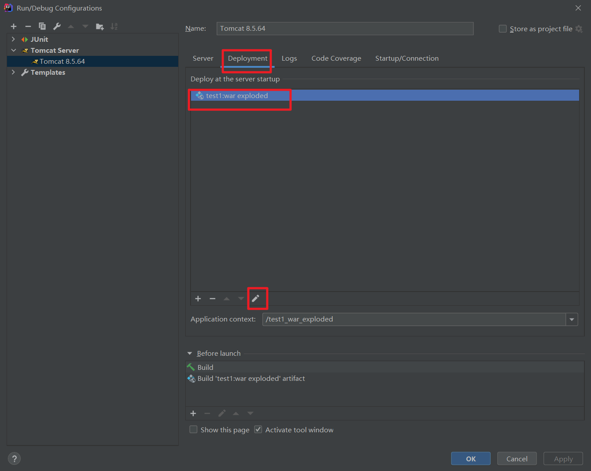

#### 	报错：java: 错误: 不支持发行版本 13

​	在`pom.xml`文件里加入：

```xml
<properties>
        <maven.compiler.source>13</maven.compiler.source>
        <maven.compiler.target>13</maven.compiler.target>
    </properties>
```

​	

#### 	数据库查询结果格式错误

```
com.huafire.entity.User@644baf4a
com.huafire.entity.User@7526515b
```

User 文件不写：

```java
@Override
    public String toString() {
        return "User{" +
                "id=" + id +
                ", username='" + username + '\'' +
                ", birthday=" + birthday +
                ", sex=" + sex +
                ", address='" + address + '\'' +
                '}';
    }

```


#### 	IDE 无法及时加载`jsp`问题

​	昨天好好的项目，但是今天`jsp` 文件却无法更新，在网上找到的解决方法，并没有起到效果。

​	所以，今天自己来搞一下。

​	网上的方法：

​	我自己试了一下，并没有成功。

​	下面说一下我自己的设置：




​	然后重启`tomcat`，解决！

#### 日期写入数据库错误

​		将日期写入数据库时，我一开始用的是Date类型，格式如下：

```sql
12/12/2000
```

​		但是在向数据库里写入数据时，我只试了六七个日期，但是只有`12/12/2000`这个日期写入以后没有错误，其他日期写入以后，都会变成其他日期，目前我没有找到规律，比如：写入`26/03/2001`，数据库里会变成`2002-02-01`。

​		问过度娘无果后，我就直接将这个数据的类型改成了字符串类型，搞定！


​	其实以上的错误实在不该，加上就没事了。

​	应该没什么其他的问题了，有什么问题欢迎大家留言讨论~

