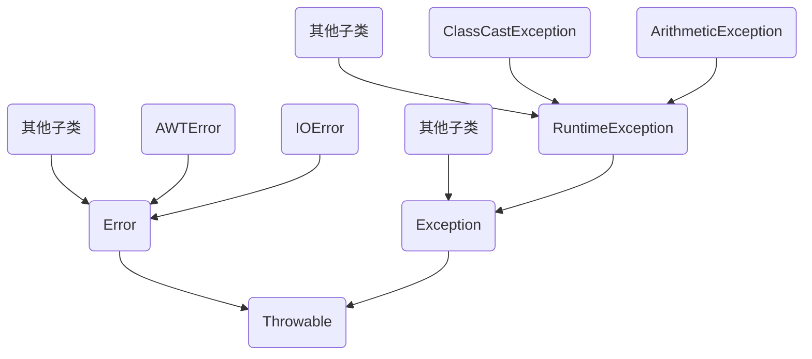

# Java基础

​	由于疫情，在家里上课...虽然有时候不方便，比如，我在三月底才拿到书...但是毕竟比在学校的事情少好多，闲暇时间

整理一下Java的笔记。

​	在刚刚开始的时候，老师建议用eclipse，并且上课用的也是eclipse，但是个人感觉还是idea用起来比较舒服，但是对于

小白来说，idea并不友好，我也是用了一个下午，才搞懂了idea，那我就简单说一下idea吧。

## idea篇

​	在我下载好idea后，刚刚一打开，我电脑中的风扇抽筋似的，疯狂转了起来，打开任务管理器后发现idea占用CPU，90%之多（我的电脑是i5的处理器，16G内存，Win10系统）对于像我这种的小白来说，第一件事肯定是先关掉idea，问过度娘以后才知道，想解决问题，可以改一下软件的配置，找到安装idea的路径D:\program files\JetBrains\IntelliJ IDEA 2019.3.4\bin\idea.exe.vmoptions，用记事本打开

```
-Xms2048m
-Xmx2048m
-XX:ReservedCodeCacheSize=240m
-XX:+UseConcMarkSweepGC
-XX:SoftRefLRUPolicyMSPerMB=50
-ea
-XX:CICompilerCount=2
-Dsun.io.useCanonPrefixCache=false
-Djava.net.preferIPv4Stack=true
-Djdk.http.auth.tunneling.disabledSchemes=""
-XX:+HeapDumpOnOutOfMemoryError
-XX:-OmitStackTraceInFastThrow
-Djdk.attach.allowAttachSelf=true
-Dkotlinx.coroutines.debug=off
-Djdk.module.illegalAccess.silent=true
```

​	将前两个数值改大，我的本来是200多，这个是内存，至于改多大，看个人电脑的配置，我的电脑内存比较大，就改的大了一点。

​	然后，当我打开idea以后，发现程序是没有办法运行的，原因是因为我安装的是jdk13.0，但是idea默认的是jdk1.8，这个在File\settings...里面，找到改一下就好了。

​	其他的基本就没有什么了，注意整理好包就好了。（因为我是初学，所以，写的程序都是独立的，不整理好包的话，会很乱）哦，对了，还有一点，就是建立包的时候，一开始我找不到新建包在哪里，右键并没有新建包，问过度娘之后，才知道，在我们新建一个文件夹以后，要想在里面建包，要右键，找到 Make Directory as... \Sources Root 点一下，我们再右键，在新建里就会出现包这个选项。

## Java基础语法篇

### 	语法

​	关于Java的基础语法的学习我就不多做介绍了，这些资源网上有好多，就大概写几个比较常用的好了

1. if 判断语句中是逻辑判断
2. switch条件语句
3. for循环和 do...while循环
4. break、continue跳转语句

### 方法

方法：一段可以重复使用的代码。（一般分为有参方法和无参方法，有参方法需要返回值，无参的不用返回值）

#### 	方法的重载

​		定义：函数名可以相同，但方法中的参数个数或类型不同，通过传入不同的参数，就可以确定调用哪个方法。

​		**注意：方法的重载与返回值类型无关，它需要满足两个条件，一是方法名相同，二是参数个数或者参数类型不同。**

```java
package test;

public class test {
    public static void main (String[] args){
        //下面是针对求和方法的调用
        int sum1 = add(1, 2);
        int sum2 = add(1, 2, 3);
        double sum3 = add(1.2, 1.3);
        //下面的代码是打印出来求和的结果
        System.out.println("sum1 = " + sum1);
        System.out.println("sum2 = " + sum2);
        System.out.println("sum3 = " + sum3);
    }
    //下面的方法实现了两个整数相加
    public static int add (int x, int y){
        return x + y;
    }
    //下面的方法实现了三个整数相加
    public static int add (int x, int y, int z){
        return x + y + z;
    }
    //下面的方法实现了两个小数相加
    public static double add (double x, double y){
        return x + y;
    }
}

```

### 数组

​	数组很重要！！！很重要！！！很重要！！！

​	定义：数组是指一组元素的集合，数组中的每个元素被称作元素

#### 	定义数组

```java
int[] x = new int[3];
```

​	元素默认值

|        数据类型        |         默认初始化值         |
| :--------------------: | :--------------------------: |
| byte、short、int、long |              0               |
|     float、double      |             0.0              |
|          char          |    一个空字符，即‘\u000’     |
|        boolean         |            false             |
|      引用数据类型      | null，表示变量不引用任何对象 |

​	给数组中的变量赋值

```java
int[] x = new int[3];
x[0] = 1;
x[1] = 2;
```


#### 	使用for循环遍历数组

```java
 int[] x= new int[3];
        for (int i = 0; i < x.length; i++){
            System.out.println(x[i]);
        }
```

​	这个时候，程序会有一个警告，会建议我们，使用增强for循环来完成遍历数组。

​	增强for循环相比较for循环来说，更为简便，下面的就是增强for循环了。

```Java
 int[] x= new int[3];
        for (int i : x){
            System.out.println(i);
        }
```


#### 	数组最值

```java
    public static void main (String[] args){
        int[] arr = {4, 1, 6, 3, 9, 8};     // 定义一个数组
        int max = getMax (arr);     // 调用有参方法getMax
        System.out.println("max = "+max);       // 打印最大值
    }
    static int getMax (int[] arr){
        int max = arr[0];       // 定义变量max为最大值，且假设第一个是最大值
        // 下面通过一个for循环遍历数组中的元素
        for (int x = 1;x < arr.length; x++){
            if (arr[x] > max){      // 比较arr[x]的值是否大于max
                max = arr[x];       // 条件成立，将arr[x]的值赋给max
            }
        }
        return max;		// 返回max
    }
```


#### 	数组排序

​	冒泡法

```java
package test;

import org.jetbrains.annotations.NotNull;

public class test {
    public static void main(String[] args){
        int[] arr = {9, 8, 3, 5, 2};
        System.out.print("冒泡排序前：");
        PrintArray(arr);        //调用方法printArray
        bubbleSort(arr);        // 调用方法bubbleSort
        System.out.print("冒泡排序后：");
        PrintArray(arr);
    }
    // 定义打印数组元素方法
    public static void PrintArray(@NotNull int[] arr){
        // 使用增强for循环，遍历数组的元素
        for (int i: arr){
            System.out.print(i+ " ");
        }
        System.out.print("\n");
    }
    public static void bubbleSort(@NotNull int[] arr){
        // 定义外层循环
        for (int i = 0; i < arr.length - 1; i++){
            // 定义内层循环
            for (int j = 0; j < arr.length - i - 1; j++){
                if (arr[j] < arr[j + 1]){		// 比较相邻元素
                    // 下面三行代码用于交换元素
                    int temp = arr[j];
                    arr[j] = arr[j + 1];
                    arr[j + 1] = temp;
                }
            }
            System.out.print("第" + (i + 1) + "论排序后：");
            PrintArray(arr);		//每轮比较完以后打印数组元素
        }
    }
}

```

#### 	多维数组

​	多维数组的定义

​		**3.5.1 第一种方式**

```java
int [][] arr = new int [3][4];
```

​	如图

|           |           |           |           |
| --------- | --------- | --------- | --------- |
| xx[0] [0] | xx[0] [0] | xx[0] [2] | xx[0] [3] |
| xx[1] [0] | xx[1] [0] | xx[1] [1] | xx[1] [3] |
| xx[2] [0] | xx[2] [0] | xx[2] [1] | xx[2] [3] |

​		

**3.5.2 第二种方式**

```java
int [][] arr = new int [3][];
```

​	如图

|           |           |           |
| --------- | --------- | --------- |
| xx[0] [0] |           |           |
| xx[1] [0] | xx[1] [1] |           |
| xx[2] [0] | xx[2] [1] | xx[2] [2] |

​		

**3.5.3 第三种方式**

```java
int[][] arr = {{1, 2}, {3, 4, 5, 6}, {7, 8, 9}}
```

​	如图

|      |      |      |      |
| :--: | :--: | :--: | :--: |
|  1   |  2   |      |      |
|  3   |  4   |  5   |  6   |
|  7   |  8   |  9   |      |


### 面向对象

​		三大特性：封装性、继承性、多态性

#### 	类与对象

##### 	类的定义

​		类是对象的抽象，用于描述一组对象的共同特征和行为。

```java
class Person {
    int age;        // 定义int型变量age
    // 定义speak()方法
    void speak(){
        System.out.println("大家好，我今年" + age + "岁！");
    }
}

```

​	上面程序中定义了一个类，其中Person是类名，age是成员变量，speak()是成员方法，方法里的变量被称为局部变量。在成员方法speak()中可以直接访问成员变量age。

##### 	 对象的创建与使用

​		创建对象格式：

```java
类名 对象名称 = new 类名();
```

​	例如：

```java
Person p = new Person();	// 创建对象p
```

​	实例：

```java
package test;

public class Person {
    int age;        // 定义int类型的变量age
    // 定义speak()方法
    void speak(){
        System.out.println("大家好，我今年" + age + "岁！");
    }
}

```

```java
package test;


class test {
    public static void main(String[] args){
        Person p1 = new Person();   // 创建第一个Person对象，p1
        Person p2 = new Person();   // 创建第二个Person对象，p2
        p1.age = 18;                // 为age属性赋值
        p1.speak();                 //调用对象方法
        p2.speak();
    }
}

```

​	**注意：上面程序中的p1和p2不能定义为null，如果定义为null，就会变成垃圾对象**

​		

##### 类的设计

​	定义一个类中的多个属性，就是类的设计。

```java
public class test {
    String name;    // 定义一个姓名属性
    int age;        // 定义一个年龄属性
    public void introduce(){
        //方法中打印属性 name 和 age 的值
        System.out.println("大家好，我叫" + name + ".我今年" + age + "岁");
    }
}

```

​		

##### 类的封装

​	类的封装是指在定义一个类的时候，将类中的属性私有化，即使用private关键字来修饰。私有属性只能在它所在的类中被访问，如果外界想要访问私有属性，需要提供一些使用public修饰的公有方法。

​	简单来说，我的理解就是，要想访问私有属性，就要写出来一个共有的方法，并且这个共有的方法里要有用到私有属性，然后再调用共有方法的同时，也就调用了私有属性。

```java
package cn.itcast.chapter03.example04;
/**
 * 实现类的封装
 */
class Student {
	private String name; // 将name属性私有化
	private int age; // 将age属性私有化

	// 下面是公有的 getXxx 和 setXxx 方法
	public String getName() {
		return name;
	}

	public void setName(String stuName) {
		name = stuName;
	}

	public int getAge() {
		return age;
	}

	public void setAge(int stuAge) {
		// 下面是对传入的参数进行检查
		if (stuAge <= 0) {
			System.out.println("对不起，您输入的年龄不合法...");
		} else {
			age = stuAge; // 对属性赋值
		}
	}

	public void introduce() {
		System.out.println("大家好，我叫" + name + ",我今年" + age + "岁!");
	}
}

public class Example04 {
	public static void main(String[] args) {
		Student stu = new Student();
		stu.setAge(-30);
		stu.setName("韩强");
		stu.introduce();
	}
}

```

​	**注意：一个Java文件里可以有多个类，但是只能有一个类被 public 修饰**


#### 	构造方法

##### 		构造方法的定义

​	在一个类里，满足下面三点的方法被称为构造方法：

1. 方法名与类名相同。
2. 在方法名的前面没有返回值的声明。
3. 在方法中不能使用 return 语句返回一个值，但是可以单独写 return 语句来作为方法的结束。

补充：应用 new 关键字调用构造方法，为新对象初始化


例（无参构造方法）：

```java
package test;

class Person {
   // 下面是类的构造方法
    public Person(){
        System.out.println("无参的构造方法被调用了...");
    }
}
public class Example{
    public static void main(String[] args){
        Person p1 = new Person();   // 实例化 Person 对象
    }
}

```

​	**注意：上面的代码中 Person p1 = new Person(); 不仅会实例化对象，还会调用构造方法Person()。**

例（有参构造方法）：

```java
class Person {
    int age;
    // 定义有参的构造方法
    public Person(int a){
        age = a;
    }
    // 定义无参的构造方法
    public void speak(){
        System.out.println("今年我已经" + age + "岁了！");
    }
}
public class Example{
    public static void main(String[] args){
        Person p1 = new Person(20);   // 实例化 Person 对象,调用了有参的构造方法，并传入参数
        p1.speak();					// 调用无参的构造方法speak
    }
}

```

​	**注意：Person p1 = new Person(20); 的功能有三个，1.实例化 Person 对象，2.调用了有参的构造方法，3.传入参数**

​		

##### 构造方法的重载（实现多态）

​	与普通的方法一样，构造方法也可以重载，在一个类中可以定义多个构造方法，只要每个构造方法的参数类型或者参数个数不同即可，在创建对象时，可以通过调用不同的构造方法来为不同的属性赋值。

例：

```java
package test;

class Person {
    String name;
    int age;
    // 定义两个参数的构造方法
    public Person(String con_name, int con_age){
        name = con_name;
        age = con_age;
    }
    // 定义一个参数的构造方法
    public Person(String con_name){
        name = con_name;
    }
    // 定义一个普通方法
    public void speak(){
        // 打印 name 和 age 的值
        System.out.println("今年" + name + "已经" + age + "岁了！");
    }
}
public class Example{
    public static void main(String[] args){
        // 分别创建两个对象 ps1 和 ps2
        Person p1 = new Person("韩强");		// 调用的是第二个一个参数的构造方法
        Person p2 = new Person("晓英", 20);	// 调用的是第一个两个参数的构造方法
        p1.speak();
        p2.speak();
    }
}

```

​	**注意：在Java中的每个类都至少有一个构造方法，要是在一个类里没有定义构造方法，系统就会自动为这个类创建一个默认的构造方法，这个默认的构造方法没有参数，方法体中没有任何代码，即什么也不做。**


#### 	this关键字

​	为了使程序可读性好，且避免成员变量和局部变量产生冲突，Java中提供了 this 来指代当前对象，用于在方法中访问对象的其他成员。

​	this有三种常见的用法

​	1、通过this关键字可以明确地访问一个类的成员变量，解决与局部变量名称冲突问题。

例：

```java
class Person {
    int age;	// 定义成员变量age
    // 定义构造方法
    public Person(int age){		// 定义局部变量age
        this.age = age;			// this.age中的age是成员变量，后面的age是局部变量
    }
    public int getAge(){
        return this.age;
    }
}

```

​	在上面的代码的构造方法中，使用 this.age 访问的是成员变量，使用 age 则访问的是局部变量。

​	2、通过 this 关键字调用成员方法

例：

```java
class Person {
    // 定义成员方法 openMouth
    public void openMouth(){
        // ...
    }
    public void speak(){
        this.openMouth();		// 调用成员方法openMouth
    }
}

```

​	在上面的代码中 this.openMouth(); 中的 this 可以省略，也就是说在上面的代码中，写成“ this.openMouth(); ” 和 “ openMouth(); ” 是一样的。

​	3、在其他构造方法中调用其他构造方法

​	构造方法是在实例化对象时被Java虚拟机自动调用，在程序中不能像调用其他的方法一样去调用构造方法，但是可以在一个构造方法中使用 “ this([参数1，参数2...]) ” 的形式来调用其他的构造方法。

例：

```java
class Person {
    public Person(){
        System.out.println("无参的构造方法被调用了...");
    }
    public Person(String name){
        this();		// 调用无参的构造方法
        System.out.println("有参的构造方法被调用了...");
    }
}
public class Example{
    public static void main(String[] args){
        Person p = new Person("itcast");		// 实例化 Person 对象
    }
}

```

​	在上面的例子中，第二个构造方法中的 this(); 直接调用了第一个构造方法，而在实例化对象的时候，调用了有参的构造方法，所以这两个构造方法都被调用了。

​	**注意：**

1. **只能在构造方法中使用 this 调用其他的构造方法，不能在成员方法中使用。**
2. **在构造方法中，使用 this 调用构造方法的语句必须放到第一行，且只能出现一次。**
3. **不能在一个类里的两个构造方法中使用 this 互相调用。**

注意 2  例：

```java
class Person {
    public Person(){
        String name = "小寒";
        this(name);
    }
}

```

​	上面的代码会报错，因为 this(); 没有放到第一行。

注意 3  例：

```java
class Person {
    public Person(){
        this ("小韩");
        System.out.println("无参的构造方法被调用了...");
    }
    public Person(String name){
        this();
        System.out.println("有参的构造方法被调用了...");
    }
}

```

​	上面的代码也会报错，因为一个类的两个构造方法中，使用 this 互相调用，所以编译的时候会报错。


####  垃圾回收

​	为了解决对象会占用大量的内存空间，Java里引入了垃圾回收机制，可以自动回收，当然也可以手动回收。

例：

```java
class Person {
    // 定义的finalize方法会在垃圾回收前调用
    public void finalize(){
        System.out.println("对象将被作为垃圾回收");
    }
}
public class Example{
    public static void main (String[] args){
        // 下面是创建了两个Person对像
        Person p1 = new Person();
        Person p2 = new Person();
        // 下面是将变量重置为null，让对象变成垃圾
        p1 = null;
        p2 = null;
        // 调用方法进行垃圾回收
        System.gc();
        for (int i = 0; i < 1000000; i++){
            // 为了延长程序运行时间
        }
    }
}

```

​	上面是代码中，我们调用了系统的 System.gc(); 方法来通知Java虚拟机立即进行垃圾回收，。当一个对象在内存中被释放时，它的 finalize 方法会被自动调用，所以可以在类中定义 finalize() 等方法来观察对象何时被释放。

​	注意，Person中定义了一个 finalize() 方法，这个方法的返回值必须是 void ，并且要用public修饰。当 p1，p2 这两个变量的值变成 null 以后，就变成了垃圾，就可以用 System.gc(); 语句来通知Java虚拟机进行垃圾回收。同时Java虚拟机进行垃圾回收前，调用了两个对象的 finalize() 方法。


####  static关键字

​	static用于修饰类的成员，如成员变量、成员方法以及代码块，被static修饰的成员具备一些特殊性，下面进行讲解。

##### 	静态变量

​	在Java中，每一个实例化后的对象，都会有一些属性，如果有一个属性所有对象都有，我们就不想给每个对象加上属性了，因为那样会很麻烦，我们可以单独设置一个属性，每次需要的时候，就可以让对象直接来访问这个属性就可以了。

​	在一个类里，可以用 static 关键字来修饰成员变量，该变量被称为静态变量。**静态变量被所有实例共享**，可以用 “类名.变量名” 来访问。

例：

```java
class Student {
    static String schoolName;       // 定义静态变量schoolName
}
public class Example{
    public static void main (String[] args){
        Student stu1 = new Student();       // 创建学生对象
        Student stu2 = new Student();
        Student.schoolName = "传智博客";    // 为静态变量赋值
        // 打印第一个学生对象的学校
        System.out.println("我的学校是" + stu1.schoolName);
        // 打印第二个学生对象的学校
        System.out.println("我的学校是" + stu2.schoolName);
    }
}

```

​	在上面代码中，由于schoolName是静态变量，所以可以直接使用 Student.schoolName 访问，也可以像上面的方式，通过 Student 的实例对象来调用，如：stu1.schoolName

​	**注意：static关键字只能用于修饰成员变量，不能用于修饰局部变量，否则会报错，例题如下：**

```java
public class Student{
	public void study(){
		static int num = 10;	// 这行代码是非法的，编译会报错
	}
}

```

​	

##### 静态方法

​	有的时候，我们希望在不创建对象的情况下就可以调用某个方法，换句话说就是不必将方法和对象绑在一起。实现这样的效果，只需要在类定义的方法前加上 static 关键字，通常称这种方法为静态方法。而调用这种方法，可以使用" 类名.方法名 "的方法来访问，当然也可以通过类的实例对象来访问。

例：

```java
class Person {
    public static void sayHello(){
        System.out.println("hello");
    }
}
public class Example{
    public static void main (String[] args){
        // 类名.方法名调用静态方法
        Person.sayHello();
        // 实例化对象的方式调用静态方法
        Person p = new Person();
        p.sayHello();
    }
}

```

​	从上面的代码中可以看出，我们可以用 类名.方法名 调用静态方法，同时我们也可以用实例化对象的方式调用静态方法。

##### 静态代码块

​	静态代码块就是用 static 修饰的代码块。当类被加载时，静态代码块会执行，由于类只加载一次，所以静态代码块只执行一次。在程序中，通常会使用静态代码块来对类的成员变量进行初始化。

```java
public class Example{
    //静态的代码块
    static {
        System.out.println("测试类的静态代码块执行了...");
    }
    public static void main (String[] args){
        Person p1 = new Person();
        Person p2 = new Person();
    }
}
class Person {
    //下面是一个静态代码块
    static {
        System.out.println("Person类中的静态代码块执行了...");
    }
}

```

​	上面的代码在运行时，是先运行两个静态方法，其中 p2 并没有作用，删掉也可以，但是不能将 p1 和 p2 全删掉，因为如果全删掉的话，Person方法就不会被调用，只会输出第一句话（测试类的...）。这个时候，就会有小伙伴问，那为什么要 new 两个  Person 呢，这是因为这个程序想告诉我们，静态代码块在类第一次使用的时，才会被加载，且只会被加载一次。

##### 成员内部类

​	在Java中，可以在一个类中定义另一个类，这个类被称为内部类。根据内部类的位置、修饰符、定义的方式分为成员内部类、静态内部类、方法内部类。

​	在内部类中，可以访问外部类的所有成员。例：

```java
class Outer{
    private int num = 4;    //定义类的成员变量
    //下面代码定义了一个成员方法，方法中访问内部类
    public void test(){
        Inner inner = new Inner();
        inner.show();
    }
    class Inner{
        void show(){
            //在成员内部类的方法中访问外部类的成员方法
            System.out.println("num = " + num);
        }
    }
}
public class Example{
    public static void main(String args[]){
        Outer outer = new Outer();  //创建外部类对象
        outer.test();   		//调用 test() 方法
    }
}

```

​	在上面的代码中，定义了一个外部类 Outer ，在外部类中创建了一个内部类的实例化对象，并调用了内部类 Inner 中的 show() 方法，在内部类中调用了外部类的 num 变量，所以可以看出，内部类可以在外部类中被调用，并能访问外部类的成员。

​	如果想通过外部类访问内部类，则要通过外部类对象去创建内部类对象，创建内部类对象的格式如下：

```java
外部类名.内部类名 变量名() = new 外部类名().new 内部类名();
```

​	同时，上面的代码中的主函数也可以这样写：

```java
public class Example{
    public static void main(String args[]){
        Outer.Inner inner = new Outer().new Inner();
        inner.show();   //调用 test() 方法
    }
}

```

​	但是如果将文件中的内部类 Inner 用 private 修饰，则会编译错误。

#### 类的继承

##### 	继承的概念

​	在Java中，类的继承是指在一个现有的类的基础上构建一个新的类，构建出来的新类被称作子类，现有类被称为父类，子类会自动拥有父类所有可继承的属性和方法。

​	在程序中，要声明一个类继承另一个类，需要使用 extends 关键字。例：

```java
class Animal{
    String name;      // 定义 name 属性
    //定义动物叫的方法
    void shout (){
        System.out.println("动物发出叫声");
    }
}
// 定义 Dog 类继承 Animal 类
class Dog extends Animal{
    // 定义一个打印 name 的方法
    public void printName(){
        System.out.println("name = " + name);
    }
}
// 定义测试类
public class Example{
    public static void main(String[] args){
        Dog dog = new Dog();	// 创建一个 Dog 类的实例化对象
        dog.name = "沙皮狗";	// 为 Dog 类的 name 属性进行赋值
        dog.printName();		// 调用 Dog 类的 getInfo() 方法
        dog.shout();			// 调用 dog 类继承来的 shout() 方法
    }
}

```

​	从上面代码可以看出，Dog 类继承了 Animal 类，同时也拥有了 name 属性和 shout() 方法。说明子类在继承父类的时候，会自动拥有父类的所有的成员。

**注意**

1、在Java中，类只支持单继承，不允许多继承，也就是说一个类只能有一个直接的父类，下面的情况是不合法的：

```Java
class A()
class B()
class C extends A,B()	// C不可以同时继承 A 类和 B 类
```

2、多个类可以同时继承同一个父类，下面的情况是合法的：

```java
class A()
class B extends A()
class C ectends A()		// 类 B 和类 C 都可以继承类 A
```

3、 在Java中，多继承是可以的，也就是一个类再去继承其他的父类，下面的情况是合法的：

```java
class A()
class B extends A()		// 类 B 继承类 A，类 B 是类 A 的子项
class C ectends B()		// 类 C 继承类 B，类 C 是类 B 的子项。同时也是类 A 的子项
```

4、在Java中，父类和子类是抽象的概念，也就是说，一个类可以是另一个类的子类，同时也可以是另一个类的父类。

##### 重写父类方法

​	可覆盖父类里的方法

```java
class Animal{
    //定义动物叫的方法
    void shout (){
        System.out.println("动物发出叫声");
    }
}
// 定义 Dog 类继承 Animal 类
class Dog extends Animal{
    // 定义狗叫的方法
    void shout(){
        System.out.println("汪汪汪...");
    }
}
// 定义测试类
public class Example{
    public static void main(String[] args){
        Dog dog = new Dog();
        dog.shout();
    }
}

```

​	子类 Dog 覆盖了父类 Aniaml 里的 shout() 方法。

**注意：重写时，子类中重写的方法需要和父类被重写的方法具有相同的方法名、参数列表以及返回值类型。且不能使用比父类中被重写的方法更严格的访问权限**

##### super关键字

​	再重写父类里的方法以后，子类对象就无法访问父类被重写的方法，为了解决这个问题，就有了 super 关键字。

1、使用 super 关键字访问父类成员变量和成员方法，格式如下：

```java
super.成员变量
super.成员方法([参数1、])
```

例：

```java
class Animal{
    String name = "动物";
    //定义动物叫的方法
    void shout (){
        System.out.println("动物发出叫声");
    }
}
// 定义 Dog 类继承 Animal 类
class Dog extends Animal{
    String name = "犬类";
    // 重写父类的 shout 方法
    void shout(){
        super.shout();      // 访问父类的成员方法
    }
    // 定义打印 name 的方法
    void printName(){
        System.out.println("name = " + super.name);     // 访问父类的成员变量
    }
}
// 定义测试类
public class Example{
    public static void main(String[] args){
        Dog dog = new Dog();    // 创建一个 Dog 对象
        dog.shout();            // 调用 dog 对象重写的 shout() 方法
        dog.printName();        // 调用 dog 对象重写的 printName() 方法
    }
}

```

​	上面代码，可以看出在 printName 方法中的 super.name 调用的是父类方法。

2、使用 super 关键字访问父类的构造方法，格式如下：

```java
super([参数1，参数2......])
```

例：

```java
class Animal{
    // 定义 Animal 类的有参的构造方法
    public Animal (String name){
        System.out.println("我是一只" + name);
    }
}
// 定义 Dog 类继承 Animal 类
class Dog extends Animal {
    public Dog(){
        super("沙皮狗");       // 调用父类有参的构造方法
    }
}
// 定义测试类
public class Example{
    public static void main(String[] args){
        Dog dog = new Dog();    // 实例化子类 Dog 对象
    }
}

```

​	在上面的代码中，我们可以看到 Dog 类是继承了 Animal 类，Dog 类里的构造方法体中，用 super 调用了 Animal 类里的构造方法，所以在调用 Dog 类里的构造法时，也调用了 Animal 类里的构造方法。

**注意：通过 super 调用父类构造方法的代码必须位于子类构造方法的第一行，并且只能出现一次**

​	在上面的代码中，如果去掉 super("沙皮狗"); 这行代码则会报错，原因：程序默认调用无参的构造方法，但是在 Animal 类里，我们只定义了有参的构造方法，并没有定义无参的构造方法，所以程序会报错。解决方法如下：

```java
class Animal{
    // 定义 Animal 无参的构造方法
    public Animal(){
        System.out.println("我是一只动物");
    }
    // 定义 Animal 有参的构造方法
    public Animal (String name){
        System.out.println("我是一只" + name);
    }
}
// 定义 Dog 类继承 Animal 类
class Dog extends Animal {
    // 定义 Dog 类无参的构造方法
    public Dog(){
        // 方法体中无代码
    }
}
// 定义测试类
public class Example{
    public static void main(String[] args){
        Dog dog = new Dog();    // 实例化子类 Dog 对象
    }
}

```

​	从上面代码中可以看出，子类在实例化对象时，默认调用了父类无参的构造方法。

**注意：在定义一个类的时候，我们尽量在类中给你定义一个无参的构造方法，避免被继承时出现错误。**

#### final关键字

##### final 关键字修饰类

​	在Java中，被 final 修饰的类不能被继承。

​	下面这个程序就会报错

例：

```Java
// 使用 final 关键字来修饰 Animal 类
final class Animal{
    // 方法体为空
}
// Dog 类继承 Animal 类
class Dog extends Animal{
    // 方法体为空
}
class Example{
    public static void main(String[] args){
        Dog dog = new Dog();    // 创建 Dog 类的实例对象
    }
}

```

**程序报错：Cannot inherit from final 'test.Animal'**

##### final 关键字修饰方法

​	当一个类的方法被 final 修饰以后，这个类的子类将不能重写该方法。

​	下面程序会报错

例：

```java
// 使用 final 关键字来修饰 Animal 类
final class Animal{
    public final void shout(){
        // 程序代码
    }
}
// Dog 类继承 Animal 类
class Dog extends Animal{
    // 重写 Animal 类的 shout() 方法
    public void shout(){
        // 程序代码
    }
}
class Example{
    public static void main(String[] args){
        Dog dog = new Dog();    // 创建 Dog 类的实例对象
    }
}

```

**程序报错：'shout()' cannot override 'shout()'; overridden method is final.**

##### final 关键字修饰变量

​	在Java中，被 final 修饰的变量称为常量，它只能被赋值一次，也就是说，被 final 修饰的变量一旦被赋值，就不能被修改。

​	下面程序会报错

例：

```java
public class Example{
    public static void main(String[] args){
        final int num = 2;  // 第一次赋值
        num = 4;            // 第二次赋值会报错
    }
}

```

**程序报错：Cannot assign a value to final varible 'num'**

​	下面这个程序可以说明，被 final 修饰的局部变量Java虚拟机不会对其进行初始化。

例：

```java
class Student{
    final String name;   // 使用 final 关键字修饰 name 属性
    // 定义 instroduce() 方法，打印学生信息
    public void instroduce(){
        System.out.println("我叫" + name + "，是一名学生");
    }
}
public class Example{
    public static void main(String[] args){
        Student stu = new Student();
        stu.instroduce();
    }
}

```

**程序报错：Variable 'name' might not have been initialized**

​	如果将第二行代码改为：

```java
final String name = "韩寒";
```

则程序就没有错误了。

​	这是因为，被 final 修饰的成员变量时，Java虚拟机不会对其进行初始化。所以使用 final 修饰局部变量时，需要在定义变量的同时，赋予一个初始值。

#### 抽象类和接口

##### 抽象类

​	一个方法中无法准确的描述一个类的行为特征，比如在上面的动物的叫声，狗的叫声和其他动物的叫声是不同的，我们无法都用同样的叫声描述所有动物。

​	在Java中，我们可以在定义方法的时候，不写方法体。不包含方法体的方法被称为抽象方法，必须用 abstract 修饰。

格式：

```java
abstract void shout();	// 定义抽象方法
```

​	当一个类里有抽象方法，这个类也必须用 abstract 修饰，被 abstract 修饰的类被称为抽象类。

例：

```java
abstract class Animal{
    // 定义抽象方法 shout()
    abstract int shout();
}

```

**注意：**

1. 包含抽象方法的类一定是抽象类，但是抽象类里可以不包含任何抽象方法。
2. 抽象类不可以被实例化，因为抽象方法里没有方法体，不可以被调用，如果想调用抽象类里的方法，则需要创建一个子类，在子类中将抽象方法实现。

例：

```java
abstract class Animal{
    // 定义抽象方法
    abstract void shout();
}
class Dog extends Animal{
    // 实现抽象方法 shout()
    void shout(){
        System.out.println("汪汪...");
    }
}
public class Example{
    public static void main(String[] args){
        Animal dog = new Dog();
        dog.shout();
    }
}

```

​	由上面的代码我们可以看出，Dog 类继承了 Animal 类，同时也实现了 shout() 方法。

​	**扩展：上面的代码倒数第二行 Animal dog = new Dog(); 可书上写的是 Dog dog = new Dog(); ，以自己琢磨一下，后面的多态(4.9.2)里会说到。**

##### 	接口

​	(提示：这一节文字较多，但是都是需要认真看的。)

​	如果一个抽象类里的所有方法都是抽象的，则可以将这个类用另一中方法来定义，被称为接口。

​	接口是由常量和抽象方法组成的特殊类，是对抽象方法的进一步抽象。

​	定义接口的时候，需要使用 interface 关键字声明，格式如下：

```java
[public] interface 接口名 [extends 接口1, 接口2...]{
	[public] [static] [final] 数据类型 常量名 = 常量值；
	[public] [abstract] 返回值 抽象方法名(参数列表);
}
```

​	在上面的语法中，一个接口可以有多个父类的接口，它们之间用逗号隔开。Java使用接口的目的是为了克服单继承的限制，因为一个类只能有一个父类，但是可以实现多个接口，接口中的变量默认使用 'public static final' 修饰，即全局变量。接口中定义的方法默认使用 'public abstract' 修饰，即抽象方法。如果接口声明是 public ，那么接口中的变量和方法全部为 public。

​	由于接口中的方法都是抽象的，因此不能通过实例化对象的方式来调用接口，此时就要定义一个类，并使用implements关键字实现接口中的所有方法。一个类可以在继承另一个类的同时实现多个接口，这些接口在 implements 子句中要使用英文逗号隔开，格式如下：

```java
[<修饰符>] class <类名> [extdends <超类名>] [implements <接口1>, <接口2>, ...]
```

例：

```java
interface Animal{
    // 定义全局变量，其默认修饰为 public static final
    String ANIMAL_BEHAVIOR = "动物的行为";
    // 定义抽象方法 breathe()，其默认修饰为 public abstract
    void breathe();
    void run();
}
class Dog implements Animal{
    // 实现 breathe() 方法
    public void breathe(){
        System.out.println(ANIMAL_BEHAVIOR + "：狗在呼吸...");
    }
    // 实现 run() 方法
    public void run(){
        System.out.println(ANIMAL_BEHAVIOR + "：狗在叫...");
    }
}
public class Example{
    public static void main(String[] args){
        Animal dog = new Dog();
        dog.breathe();
        dog.run();
    }
}

```

​	由上面的代码中我们可以看出，类 Dog 在实现了 Animal 接口后，是可以被实例化的，并且实例化以后，就可以调用 Dog 类里的方法。**注意：一个类实现一个接口，必须给出接口中所有方法的实现，如果不能实现某个方法，也必须写出一个空方法。**

​	(在Java里，“ ” 用双引号引起来的在java中会被当作一个字符串类型（String）进行处理，‘ ’ 用单引号引起来的在java中会被当作字符类型（Char）的来处理 ,Char可直接转换成 int 类型（及它所对应的ASCII码），所以在上面程序中的 "动物的行为" 只能用双引号。)

​	当然，一个接口也可以用 extends 关键字去继承另一个接口，例：

```java
interface Animal{
    // 定义全局变量，其默认修饰为 public static final
    String ANIMAL_BEHAVIOR = "动物的行为";
    // 定义抽象方法 breathe() 和 run()，其默认修饰为 public abstract
    void breathe();
    void run();
}
// 定义接口 LandAnimal 继承接口 Animal 
interface LandAnimal extends Animal{
    // 定义抽象方法 liveOnLand()
    void liveOnLand();
}
class Dog implements LandAnimal{
    // 实现 breathe() 方法
    public void breathe(){
        System.out.println(ANIMAL_BEHAVIOR + ":狗在呼吸...");
    }
    // 实现 run() 方法
    public void run(){
        System.out.println(ANIMAL_BEHAVIOR + ":狗在叫...");
    }
    // 实现 liveOnLand() 方法
    public void liveOnLand(){
        System.out.println("狗是陆地上的动物...");
    }
}
public class Example{
    public static void main(String[] args){
        LandAnimal dog = new Dog();
        dog.breathe();
        dog.run();
        dog.liveOnLand();
    }
}

```

​	在上面的代码中，LandAnimal 接口继承了 Animal 接口，同时拥有了 Animal 接口里的所有的抽象方法。当 Dog 类实现实例化接口的时候，需要实例化这两个接口里的所有抽象方法。

接口的特点：

- 接口中的方法都是抽象的，不能实例化对象。
- 接口中的属性只能是常量。
- 当一个类实现接口时，如果这个类是抽象类，则实现接口中的部分方法即可，否则需要实现接口中的所有方法。
- 一个类通过 implements 关键字实现接口的时，可以实现多个接口的时候，被实现的多个接口之间要用逗号隔开。实例如下：

```java
interface Animal{
	// 程序...
}
interface LandAnimal{
	// 程序...
}
class Dog implements Animal, LandAnimal{
	// 程序...
}
```

- 一个接口可以通过 extends 关键字来继承多个接口，接口之间用逗号隔开，实例如下：

```java
interface Animal{
	// 程序...
}
interface LandAnimal{
    // 程序...
}
interface Dog extends Animal, LandAnimal{
    // 程序...
}
```

- 一个类在继承另一个类的同时，也可以实现接口，但是 extends 关键字必须在 implements 关键字之前。实例如下：

```java
class Dog extends Canidae implements Animal{
    // 程序...
} 
```

#### 多态

##### 多态概述

​	多态概述：在同一个方法中，这种由于参数类型不同，而导致执行结果效果各异的现象就是多态。

​	继承是多态实现的基础。

​	个人理解：多态是指同名的不同方法在程序中共存。

例：

```java
// 定义 Animal 接口
interface Animal{
    void shout();
}
// 定于 Cat 类，实现 Animal 接口
class Cat implements Animal{
    // 实现 shout() 方法
    public void shout(){
        System.out.println("喵喵...");
    }
}
// 定义 Dog 类，实现 Animal 接口
class Dog implements Animal{
    // 实现 dhout() 方法
    public void shout(){
        System.out.println("汪汪...");
    }
}
public class Example{
    public static void main(String[] args){
        Animal an1 = new Cat();
        Animal an2 = new Dog();
        animalShout(an1);	// 调用 animalShout() 方法，并传入参数
        animalShout(an2);	// 调用 animalShout() 方法，并传入参数
    }
    // 定义静态的 animalShout() 方法，接收一个 Animal 类型的参数
    public static void animalShout(Animal an){
        an.shout();			// 调用实际参数的 shout() 方法
    }
}

```

​	在上面的代码中，我们定义了 Animal 接口，同时也定义了 Dog 类和 Cat 类，通过传入的参数不同，使用了不同的方法。由此可见，多态不仅解决了方法的同名的问题，而且还使程序变的更加灵活，从而有效的提高了程序的可扩展性和可维护性。

##### 对象的类型转换

​	我们在使用多态时，常常涉及到将子类对象当作父类类型使用，这种情况在 Java 中被称为 “向上转型” ，实例如下：

```java
Animal an1 = new Cat();		// 将 Cat 对象当作 Animal 类型来用
Animal an2 = new Dog();		// 将 Dog 对象当作 Animal 类型来用
```

​	将子类对象当作父类对象使用时不需要任何显示地声明，但是需要注意的是，此时不能通过父类变量去调用子类中特有的方法。

​	下面的代码是演示对象的类型转换情况：

```Java
interface Animal{
    void shout();
}
class Cat implements Animal{
    public void shout(){
        System.out.println("喵喵...");
    }
    void sleep(){
        System.out.println("猫睡觉...");
    }
}
public class Example{
    public static void main(String[] args){
        Cat cat = new Cat();
        animalShout(cat);		// 向 animalShout 方法里传入参数
    }
    public static void animalShout(Animal animal){
        animal.shout();		// 调用 shout() 方法
        animal.sleep();		// 调用 sleep() 方法
    }
}

```

​	上面的代码会报错：Cannot resolve method 'sleep' in 'Animal'

​	这是因为 animalShout 方法里的参数类型是 Animal 类型，但是 Animal 类里没有定义 sleep 方法，所以会提示在 Animal 类里找不到 sleep 方法。

​	修改方法有两种：

第一种：

```java
public static void animalShout(Animal animal){
        Cat cat = (Cat) animal; 	// 将 animal 对象强制转换为 Cat 类型
        cat.shout();
        cat.sleep();
    }
```

​	这种方法是把 animalShout() 方法中的 Animal 类型的变量强制转化为 Cat 类型。

第二种：

```java
public static void animalShout(Cat animal){		// 直接定义为 Cat 类型的参数
        animal.shout();
        animal.sleep();
    }
}

```

​	虽然看起来是两种方法，但是原理都是一样的，都是将参数传到 Cat 类型里。

​	在Java中，我们也可以用 instanceof 关键字来判断一个对象是否为某个类(或接口)的实例或者子类实例，格式如下：

```java
对象(或者对象引用变量) instanceof 类(或接口)
```

​	实例如下：

```java
interface Animal{
//    void shout();
}
class Cat implements Animal{
    public void shout(){
        System.out.println("喵喵...");
    }
    void sleep(){
        System.out.println("猫睡觉...");
    }
}
class Dog implements Animal{
    public void shout(){
        System.out.println("汪汪...");
    }
}
public class Example{
    public static void main(String[] args){
        Cat cat = new Cat();
        Dog dog = new Dog();
        animalShout(cat);
        animalShout(dog);
    }
    public static void animalShout(Animal animal){
        if (animal instanceof Cat){
            Cat cat = (Cat) animal;
            cat.shout();
            cat.sleep();
        }
        else {
            System.out.println("This animal is not a Cat.");
        }
    }
}

```

##### Object 类

​	在 JDK 中提供了一个 Object 类，**它是类层次结构的根类，每个类都直接或间接继承自该类，所有对象 (包括数组) 都实现了这个类的方法**，如下图：

|  方法名称  |              方法说明              |
| :--------: | :--------------------------------: |
|  equals()  | 指示其他某个对象是否与此对象“相等” |
| getClass() |     返回此 Object 的运行时的类     |
| hashCode() |        返回该对象的哈希码值        |
| toString() |       返回该对象的字符串表示       |

​	下面是 Object 类里的 toString() 方法的使用：

```java
// 定义 Animal 类
class Animal{
    void shout(){
        System.out.println("动物叫!");
    }
}
public class Example{
    public static void main(String args[]){
        Animal animal = new Animal();
        System.out.println(animal.toString());
    }
}

```

​	运行结果是：

```java
test.Animal@2f4d3709
```

​	Animal 类里并没有 toString() 方法，但是调用的时候，并没有报错，因为 Animal 类默认继承 Object 类，Object 类里定义了 toString() 方法，在这个方法里输出了对象所属类的类名。Object 类里的 toString() 方法中的具体代码如下：

```java
getClass().getName() + "@" + Integer.toHexString(hashCode());
```

​	上面的代码具体含义如下：

- getClass().getName() 代表返回对象所属类的类名，即 Animal。

- hashCode() 代表返回该对象的哈希值。

- Integer.toHexString(hashCode()) 代表将对象的哈希值用十六进制表示。

  ​	其中，hashCode() 是 Object 类中的一个方法，这个方法将对象的内存地址进行哈希运算，返回一个 int 类型的哈希值。

  ​	在实际运用中，通常希望对象的 toString() 方法返回的不仅仅是基本信息，而是一些特有的信息。这时就要重写 Object 类中的 toString() 方法了。

  ​	例子：

  ```java
  // 定义 Animal 类
  class Animal{
      public String toString(){
          return "这个是一只动物...";
      }
  }
  public class Example{
      public static void main(String args[]){
          Animal animal = new Animal();
          System.out.println(animal.toString());
      }
  }
  
  ```

  ​	重写了 toString() 方法以后，当我们调用这个方法以后，就打印出了 Animal 类里的描述信息 "这个是一只动物..."。

##### 匿名内部类

​	在Java中，在类里的定义的类称为内部类 (Inner Class) ，内部类是外部类的成员。Java 的内部类可以分为成员内部类、方法内部类和匿名内部类等。

​	我们可以用匿名内部类来实现接口。匿名内部类就是没有名字的内部类，表面看起来好像有名字，实际那并不是它的名字。当程序使用匿名类的时候，在定义匿名内部类的地方往往直接创建该类的一个对象。

例：

```java
interface Animal{
    void shout();
}
public class Example{
    public static void main(String args[]){
        // 定义一个内部类 Cat 来实现 Animal 接口
        class Cat implements Animal{
            public void shout(){
                System.out.println("喵喵...");
            }
        }
        animalShout(new Cat());	// 调用 animalShout() 方法并传入 Cat 对象
    }
    // 定义静态方法 animalShout()
    public static void animalShout(Animal an){
        an.shout();
    }
}

```

​	在上面的代码中，可以看出内部类 Cat 类实现了 Animal 接口，在调用 animalShout() 方法时，将 Cat 类的实例对象作为参数传入到方法中，从而输出相应的结果。

​	匿名内部类的格式如下：

```java
new 父类(参数列表) 或 父接口(){
    // 匿名内部类实现部分
}
```

​	改写后的代码：

```java
interface Animal{
    void shout();
}
public class Example{
    public static void main(String args[]){
        // 定义匿名内部类作为参数传递给 animalShout() 方法
        animalShout(new Animal() {
            // 实现 shout() 方法
            public void shout() {
                System.out.println("喵喵...");
            }
        });
    }
    // 定义静态方法 animalShout()
    public static void animalShout(Animal an){
        an.shout();
    }
}

```

​	上面的两块代码，运行结果是一样的，但是后者的代码比较难理解。

​	下面分两步说明匿名内部类：

1. 在调用 animalShout() 方法时，在方法的参数位置写上 new Animal(){};，这相当于创建了一个实例对象，并将对此昂作为参数传给 animalShout() 方法。在 new Animal() 后面有一对大括号，表示创建的对象为 Animal 的子类实例，该子类是匿名的。具体代码如下：

   ```java
   animalShout(new Animal(){});
   ```

2. 在大括号中编写匿名子类的实现代码，如下：

```java
animalShout(new Animal(){
    public void shout(){
        System.out.println("喵喵...")
    }
});
```

​	至此便完成了匿名内部类的编写。匿名内部类是实现接口的一中简便的写法，在程序中不一定非要用匿名内部类。不要求完全掌握，了解即可。

#### 异常

##### 什么是异常

​	异常就是程序遇到 Bug 了。

​	在 Java 中提供了大量的异常类，这些类都继承自 java.lang.Throwable 类。Throwable 类有两个直接子类，一个是 Error 类，代表程序产生的错误，另一个是 Exception 类，代表程序中产生的异常。

- **Error 类**

  ​	Error类称为错误类，它代表 Java 运行时产生的系统内部错误或者资源耗尽的错误，是比较严重的，仅靠修改程序本身是不能恢复执行的。例如：使用 Java 命令去执行一个不存在的类就会出现 Error 错误。

- **Exception 类**

  ​	Exception 类称为异常类，它表示程序本身可以处理的错误。在开发 Java 程序中进行的异常处理都是针对 Exception 类及其子类。在 Exception 类的众多子类中有一个特殊的 RuntimeException 类，该类及其子类用于表示运行时异常。除了此类，Exception 类下所有其他子类都用于表示编译异常。

下面用树状图表示继承关系：



​																		**Throwable体系架构图**

​	Throwable 类中常用的方法：

|              方法声明               | 功 能 描 述                               |
| :---------------------------------: | :---------------------------------------- |
|         String getMessage()         | 返回此 throwable 的详细消息字符串         |
|       void printStackTrace()        | 将此 throwable 及其追踪输出至标准错误流   |
| void printStackTrace(PrintStream s) | 将此 throwable 及其追踪输出到指定的输出流 |

​	注：由于 Error 和 Exception 都继承自 Thowable 类，所以它们都有这些方法。


##### try...catch 和 finally

​	在程序运行的时候，因为发生了异常导致程序立刻终止，所以无法继续向下执行了。Java 中提供了对异常处理的方式———异常捕获。通常用 try...catch 语句，例：

```java
try{
    //程序代码块
}catch(ExceptionType(Exception 类及其子类) e){
    //对 ExceptionType 处理
}
```

​	其中，try 代码块中是可能发生异常的 Java 语句，catch 代码块中编写针对异常进行处理的代码。当 try 中的代码发生了异常，系统会将这个异常信息封装成一个异常对象，并将这个对象传递给 catch 代码块。catch 代码块需要参数指明它所能够接收的异常类型，这个参数的类型必须是 Exception 类或者子类。

​	例如：

```java
public class test{
    public static void main(String[] args){
        try {
            int result = divide(4, 0);
            System.out.println(result);
        }catch (Exception e){
            System.out.println("捕获的异常行为:" + e.getMessage());
        }
        System.out.println("程序继续向下执行...");
    }
    public static int divide(int x, int y){
        int result = x / y;
        return result;
    }
}
```

​	输出结果：捕获的异常行为为:/ by zero
​	程序继续向下执行...

​	上面的程序中，我们用 try...catch 对可能发生异常的代码进行了处理，发生异常语句后面的代码是不会被执行的，当我们调用 getMessage 方法对异常处理完后，代码会（跳出 try...catch）继续向下执行。

​	在程序中，我们有时候希望有些语句无论是否发生异常都要执行，这个时候就需要在 try...catch 语句后加上一个 finally 代码块。例如：

```java
public class test{
    public static void main(String[] args){
        try {
            int result = divide(4, 0);
            System.out.println(result);
        }catch (Exception e){
            System.out.println("捕获的异常行为为:" + e.getMessage());
            return;		//用于结束当前语句
        }finally {
            System.out.println("进入finally代码块...");
        }
        System.out.println("程序继续向下执行...");
    }
    public static int divide(int x, int y){
        int result = x / y;
        return result;
    }
}
```

​	在 catch 代码块中增加一个 return 语句，用于结束当前方法，此时第12行代码就不会被执行了，但是 finally 里的语句还是会执行，并不会受到 return 语句的影响。也就是说，不论程序是发生了异常还是使用 return 语句，都不会影响 finally 语句的执行。所以，我们通常会在 try...catch 后加上 finally 来完成必须执行的事情，例如：释放系统资源。

​	注意：只有一种情况 finally 是不会被执行的，那就是在 try...catch 中执行 System.exit(0) 语句，System.exit(0)代表的是退出当前Java虚拟机，Java虚拟机停止了，任何程序都无法运行了。

##### throws 关键字

​	我们在写代码的时候，我们自己清楚自己写的代码哪里可能会出错，但是别人调用的时候可能就不知道，我们可以使用 throws 方法，先声明这个方法可能会发生的异常，这样调用者在调用方法的时候，就知道这个方法可能有异常，这样就可以在程序中对异常处理。

​	throws 关键字使用格式：

```java
修饰符 返回值类型 方法名([参数1, 参数2......])throws ExceptionType1 [, Exception Type2......]{

}
```

​	例：

```java
public class test{
    public static void main(String[] args){
        int result = divide(4, 2);
        System.out.println(result);
    }
    public static int divide(int x, int y)throws Exception{
        int result = x / y;
        return result;
    }
}
```

​	在 IDEA 中程序报错：Unhandled exception: java.lang.Exception。

​	运行后报错：Error:(5, 28) java: 未报告的异常错误 java.lang.Exception; 必须对其进行捕获或声明以便抛出。

