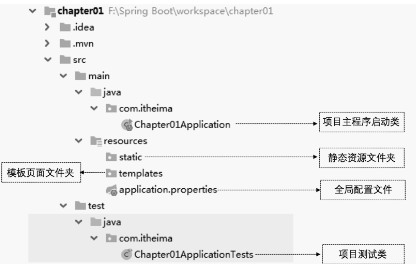
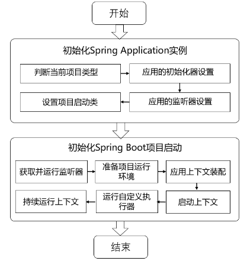
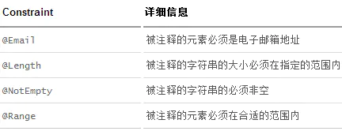

​	可以用`Maven`构建`Spring Boot`项目，当然也可以用`Spring Initializr`构建`Spring Boot`项目，具体步骤就不写了。

### 	添加`Spring Boot`相关依赖

```xml
<!-- 引入SpringBoot相关依赖 -->
<parent>
    <artifactId>spring-boot-starter-parent</artifactId>
    <groupId>org.springframework.boot</groupId>
    <version>2.5.2</version>
  </parent>

  <dependencies>
	<!-- 引入Web场景依赖启动器 -->
    <dependency>
      <groupId>org.springframework.boot</groupId>
      <artifactId>spring-boot-starter-web</artifactId>
    </dependency>
  </dependencies>
```

​	上面代码中，`<parent>`标签中添加的`spring-boot-starter-parent`依赖是`SpringBoot`框架集成项目的统一父类管理依赖，添加该依赖后就可以使用`SpringBoot`的相关特性；`<version>`标签是指定`SpringBoot`的版本号是`2.5.2`，`  <dependencies>`标签中添加的`spring-boot-starter-web`依赖是`SpringBoot`框架对`Web`开发场景集成支持的依赖启动器，添加后就可以自动导入`Spring MVC`框架相关依赖进行`Web`开发了。

​	注意：导入依赖后最好刷新一下`Maven`


### 编写出程序启动类

​	在我们创建的项目中的`java`文件夹下创建一个名称为`com.learn`的包，在该包下创建一个主程序启动类`Starter`，内容如下：

```java
package com.learn;

import org.springframework.boot.SpringApplication;
import org.springframework.boot.autoconfigure.SpringBootApplication;

@SpringBootApplication
public class Starter {

    public static void main(String[] args) {
        SpringApplication.run(Starter.class);
    }
}

```

​	其中`@SpringBootApplication`是`SpringBoot`框架的核心注解，用于表明`Start`类是`SpringBoot`项目的主程序启动类。第10行代码调用`SpringApplication.run()`方法启动主程序类。


### 创建用于Web访问的`Controller`

​	在`com.learn`包下创建一个`controller`的包，在这个包下创建一个名称为`HelloController`的请求处理控制类，并编写一个请求处理方法，内容如下：

```java
package com.learn.controller;

import org.springframework.web.bind.annotation.GetMapping;
import org.springframework.web.bind.annotation.RestController;

@RestController
public class HelloController {

    @GettMapping("/hello")
    public String hello() {
        return "Hello Spring Boot";
    }
}
```

1. `@RestController`注解是一个组合注解，等同于`@Controller`和`@ResponseBody`两个注解结合使用的效果。主要作用是将当前类作为控制层的组件添加到`Spring`容器中，同时该类的方法无法返回`JSP`页面，而且会返回`JSON`字符串。
2. `@GetMapping`注解等同于`@RequestMapping(method=RequestMethod.GET)`注解，主要作用是设置方法的访问路径并限定其访问方法为`Get`。


### 运行项目

​	项目运行成功后，在控制台上会发现`SpringBoot`项目默认启动的端口号为8080，在浏览器上访问"http://127.0.0.1:8080/hello"。输出内容是“Hello Spring Boot”。

​	利用`Spring Initializr`创建的项目结构如下



```xml
<build>
    <plugins>
        <!-- Maven打包工具插件 -->
      <plugin>
        <groupId>org.springframework.boot</groupId>
        <artifactId>spring-boot-maven-plugin</artifactId>
      </plugin>
    </plugins>
  </build>
```


### 热部署

​	个人不太喜欢用热部署，网上有很多教程，就不写了。

​	`Ctrl+F5`是个好东西，感兴趣的小伙伴可以尝试一下


### 部分核心注解详解

​	`@SpringBootApplication`注解是一个组合注解，包含`@SpringBootConfiguration`、`@EnableAutoConfiguration`和`@ComponentScan`3个核心注解。具体如下：

1. `@SpringBootConfiguration`注解

   ​	`@SpringBootConfiguration`注解表示`SpringBoot`配置类。查看`@SpringBootConfiguration`注解源码，核心代码如下：

   ```java
   @Target(ElementType.TYPE)
   @Retention(RetentionPolicy.RUNTIME)
   @Documented
   @Configuration
   @Indexed
   public @interface SpringBootConfiguration {
   	@AliasFor(annotation = Configuration.class)
   	boolean proxyBeanMethods() default true;
   }
   ```

   ​	上面代码可以看出，`@SpringBootConfiguration`注解内部有一个核心注解`@Configuration`该注解是`Spring`框架提供的，表现当前类为一个配置类（XML配置文件的注解表现形式），并可以被组件扫描器扫描，由此可见，`@SpringBootConfiguration`注解的作用与`@Configuration`注解相同，都是标识一个可以被组件扫描器扫描的配置类，只不过`@SpringBootConfiguration`是被`SpringBoot`进行了重新封装命令了。

2. `@EnableAutoConfiguration`注解

   ​	`@EnableAutoConfiguration`注解是表示开启自动配置功能，该注解是`SpringBoot`框架最重要的注解，也是实现自动化配置的注解，同样，查看该注解内部查看源码信息，核心代码如下：

   ```java
   @Target(ElementType.TYPE)
   @Retention(RetentionPolicy.RUNTIME)
   @Documented
   @Inherited
   @AutoConfigurationPackage					// 自动配置包
   @Import(AutoConfigurationImportSelector.class)// 自动配置类扫描导入
   public @interface EnableAutoConfiguration {
   
   	String ENABLED_OVERRIDE_PROPERTY = "spring.boot.enableautoconfiguration";
   	Class<?>[] exclude() default {};
   	String[] excludeName() default {};
   }
   ```

   ​	上面代码可以看出，`@EnableAutoConfiguration`注解是一个组合注解，主要包含有`@AutoConfigurationPackage`注解和`@Import`两个核心注解，下面对这两个注解介绍：

   1. `@AutoConfigurationPackage`注解

      查看其源码信息如下：

      ```java
      @Target(ElementType.TYPE)
      @Retention(RetentionPolicy.RUNTIME)
      @Documented
      @Inherited
      @Import(AutoConfigurationPackages.Registrar.class)// 导入Registrar中注册的组件
      public @interface AutoConfigurationPackage {
          
      	String[] basePackages() default {};
      	Class<?>[] basePackageClasses() default {};
      }
      ```

      ​	上面源码可以看出，`@AutoConfigurationPackage`注解的功能是由`@Import`实现的，作用是向容器中导入注册的所有组件，导入的组件由`Registrar`决定。查看`Registrar`的源码如下：

      ```java
      static class Registrar implements ImportBeanDefinitionRegistrar, DeterminableImports {
      
      		@Override
      		public void registerBeanDefinitions(AnnotationMetadata metadata, BeanDefinitionRegistry registry) {
      			register(registry, new PackageImports(metadata).getPackageNames().toArray(new String[0]));
      		}
      		...
      	}
      ```

      ​	上面代码中，在`Registrar`类中有一个`registerBeanDefinitions()`方法，使用`Debug`模式中会发现上面代码中加粗部分获取的是项目主程序启动类所在的目录`com.itheima`。也就是说，`@AutoConfigurationPackage`注解的主要所用是获取项目主程序启动类所在的根目录，从而制定后续组件扫描器要扫描的包位置。因此在定义项目包结构时，要求定义的包结构非常规范，项目主程序启动类要定义在最外层的根目录位置，然后在根目录位置内部建立子包和类进行业务开发，这样才能保证定义的类能够被组件扫描器扫描。

   2. `@Import(AutoConfigurationImportSelector.class)`注解

      ​	查看`AutoConfigurationImportSelector`类里的`getAutoConfigurationEntry()`方法，代码如下：

      ```java
      protected AutoConfigurationEntry getAutoConfigurationEntry(AnnotationMetadata annotationMetadata) {
      		if (!isEnabled(annotationMetadata)) {
      			return EMPTY_ENTRY;
      		}
      		AnnotationAttributes attributes = getAttributes(annotationMetadata);
          	// 获取所有SpringBoot提供的后续自动配置类xxxAutoConfiguration
      		List<String> configurations = getCandidateConfigurations(annotationMetadata, attributes);
      		configurations = removeDuplicates(configurations);
      		Set<String> exclusions = getExclusions(annotationMetadata, attributes);
      		checkExcludedClasses(configurations, exclusions);
      		configurations.removeAll(exclusions);
          	// 筛选并过滤出当前应用环境下需要的自动配置类xxxAutoConfiguration
      		configurations = getConfigurationClassFilter().filter(configurations);
      		fireAutoConfigurationImportEvents(configurations, exclusions);
      		return new AutoConfigurationEntry(configurations, exclusions);
      	}
      ```

      ​	上面的`getAutoConfigurationEntry()`方法，其主要作用是筛选出当前项目运行需要启动的自动配置类`xxxAutoConfiguration`，从而实现当前项目运行所需的自动配置环境。另外，在上述核心方法加注释的地方显示了两个比较重要的业务处理方法，具体说明如下：

      - `getCandidateConfigurations(annotationMetadata, attributes)`方法：该方法的主要作用是从`SpringBoot`提供的自动配置依赖`META-INF/spring.factories`文件中获取所有候选自动配置类`xxxAotuConfiguration`（`springboot2.5.2`版本中提供的自动配置类有131个）。

      - `configurations = getConfigurationClassFilter().filter(configurations);`方法：该方法的作用是对所有候选的自动配置类进行筛选，根据项目`pom.xml`文件中加入的依赖文件筛选出最终符合当前项目运行环境对应的自动配置类（筛选完成后可能只有25个）。

        `META-INF/spring.factories`文件路径如下：

      

3. `@ComponentScan`注解

   ​	`@ComponentScan`注解是一个组件包扫描器，用于指定包中注解类自动配置到`Spring`的`Bean`容器中。

   ​	`@ComponentScan`注解具体扫描的包的根路径由`SpringBoot`项目主程序启动类所在包的位置决定，在扫描过程中由前面介绍的`@AutoConfigurationPackage`注解进行解析，从而得到`SpringBoot`项目主程序启动类所在包的具体位置。


### SpringBoot 执行流程

​	每个`SpringBoot`项目都有一个主程序启动类，在主程序启动类中有一个启动项目的`main()`方法，在该方法中通过执行`SpringApplication.run()`即可启动整个`SpringBoot`程序。`run()`方法内部的源码如下：

```java
public static ConfigurableApplicationContext run(Class<?> primarySource, String... args) {
		return run(new Class<?>[] { primarySource }, args);
	}
public static ConfigurableApplicationContext run(Class<?>[] primarySources, String[] args) {
		return new SpringApplication(primarySources).run(args);
	}
```

​	上面代码中可以看出，`SpringApplication.run()`方法内部执行了两个操作，分别是`SpringApplication`实例的初始化和调用`run()`启动项目，这两个阶段的实现具体说明如下。

1. ##### `SpringApplication`实例的初始化

   查看`SpringApplication`实例对象初始化源码如下：

   ```java
   public SpringApplication(ResourceLoader resourceLoader, Class<?>... primarySources) {
   		this.resourceLoader = resourceLoader;
   		Assert.notNull(primarySources, "PrimarySources must not be null");
   		this.primarySources = new LinkedHashSet<>(Arrays.asList(primarySources));
   		this.webApplicationType = WebApplicationType.deduceFromClasspath();
   		this.bootstrapRegistryInitializers = getBootstrapRegistryInitializersFromSpringFactories();
   		setInitializers((Collection) getSpringFactoriesInstances(ApplicationContextInitializer.class));
   		setListeners((Collection) getSpringFactoriesInstances(ApplicationListener.class));
   		this.mainApplicationClass = deduceMainApplicationClass();
   	}
   ```

   ​	在上面代码中能看出，`SpringApplication`初始化过程主要包含了4部分，具体如下：

   1. `this.webApplicationType = WebApplicationType.deduceFromClasspath();`用于判断当前`webApplicationType`应用类型。`deduceFromClasspath()`方法用于查看`Classpath`类路径下是否存在某个特征类，从而判断当前`webApplicationType`类型是`SERVLET`应用（`Spring5`之前的传统`MVC`应用）还是`REACTIVE`应用（`Spring5`开始出现的`WebFlux`交互式应用）。
   2. `setInitializers((Collection) getSpringFactoriesInstances(ApplicationContextInitializer.class));`用于设置`SpringApplication`应用的初始化器。在初始化设置过程中，会使用`Spring`类加载器`SpringFactoriesLoader`从`META-INF/spring.factories`文件中获取所有可用的应用初始化器类`ApplicationContextInitializer`。
   3. `setListeners((Collection) getSpringFactoriesInstances(ApplicationListener.class));`用于设置`SpringApplication`应用的监听器。监听器设置过程与上一步初始化器设置的过程基本一样，也是使用`SpringFactoriesLoader`从`META-INF/spring.factories`文件中获取所有可用的应用初始化器类`ApplicationContextInitializer`。
   4. `this.mainApplicationClass = deduceMainApplicationClass();`用于推断并设置项目`main()`方法启动的主程序启动类。

   

2. ##### 项目的初始化启动

   ​	下面是`run(args)`方法执行的项目初始化启动过程，核心代码如下：

   ```java
   public ConfigurableApplicationContext run(String... args) {
   		StopWatch stopWatch = new StopWatch();
   		stopWatch.start();
   		DefaultBootstrapContext bootstrapContext = createBootstrapContext();
   		ConfigurableApplicationContext context = null;
   		configureHeadlessProperty();
       
       	// 1.获取SpringApplication初始化的SpringApplicationRunListener运行监听器并运行
   		SpringApplicationRunListeners listeners = getRunListeners(args);
   		listeners.starting(bootstrapContext, this.mainApplicationClass);
       
   		try {
   			ApplicationArguments applicationArguments = new DefaultApplicationArguments(args);
               
               // 2.项目运行环境Environment的预配置
   			ConfigurableEnvironment environment = prepareEnvironment(listeners, bootstrapContext, applicationArguments);
   			configureIgnoreBeanInfo(environment);
               
   			Banner printedBanner = printBanner(environment);
               
               // 3.项目应用上下文ApplicationContext的预配置
   			context = createApplicationContext();
   			context.setApplicationStartup(this.applicationStartup);
   			prepareContext(bootstrapContext, context, environment, listeners, applicationArguments, printedBanner);
   			refreshContext(context);
   			afterRefresh(context, applicationArguments);
               
   			stopWatch.stop();
   			if (this.logStartupInfo) {
   				new StartupInfoLogger(this.mainApplicationClass).logStarted(getApplicationLog(), stopWatch);
   			}
               
               // 4.由项目运行监听器启动配置好的应用上下文ApplicationContext
   			listeners.started(context);
               
               // 5.调用应用上下文ApplicationContext中配置的程序执行器xxxRunner
   			callRunners(context, applicationArguments);
               
   		}
   		catch (Throwable ex) {
   			handleRunFailure(context, ex, listeners);
   			throw new IllegalStateException(ex);
   		}
   
   		try {
               
               // 6.由项目运行监听器持续运行配置好的应用上下文ApplicationContext
   			listeners.running(context);
               
   		}
   		catch (Throwable ex) {
   			handleRunFailure(context, ex, null);
   			throw new IllegalStateException(ex);
   		}
   		return context;
   	}
   ```

   ​	由上面源码可以看出，项目初始化启动过程大致包含6个部分：

   1. `getRunListeners(args)`和`listeners.starting()`方法主要用于获取`SpringApplication`实例初始化过程中初始化的`SpringApplicationRunListener`监听器并运行。
   2. `prepareEnvironment(listeners, bootstrapContext, applicationArguments);`方法主要用于对项目运行环境进行预设置，同时通过`configureIgnoreBeanInfo(environment);`方法排除一些不需要的运行环境。
   3. `context = createApplicationContext();`方法及下面4行代码，主要作用是对项目应用上下文`ApplicationContext`的预设置，包含先创建应用上下文环境`ApplicationContext`，接着使用之前初始化设置的`context`（应用上下文环境）、`enviroment`（项目运行环境）、`listener`（运行监听器）、`applicationArguments`（项目参数）和`printBanner`（项目图标信息）进行应用上下文的组装配置，并刷新配置。
   4. `listeners.started(context)`方法用于使运行监听器`SpringApplicationRunListener`启动配置好的应用上下文`ApplicationContext`。
   5. `callRunners(context, applicationArguments);`方法用于调用项目中自定义的执行器`XxxRunner`类，使得在项目启动完成后立即执行一些特定程序。其中，`SpringBoot`提供的执行器接口有`ApplicationRunner`和`CommandLineRunner`两种，在使用时只需要定义一个执行器类实现其中一个接口并重写对应的`run()`方法接口，`SpringBoot`项目启动后会立即执行这些特定程序。
   6. `listeners.running(context);`方法表示在前面一切初始化启动都没有问题的情况下，使用运行监听器`SpringApplicationRunListener`持续运行配置好的应用上下文`ApplicationContext`，这样整个`SpringBoot`项目就正式启动成功了。与此同时，经过初始化封装设置的应用上下文`ApplicationContext`也处于活跃状态。




### 全局配置文件

#### 	`application.properties`配置文件

​	使用`Spring Initializr`方式构建`SpringBoot`项目时，会在`resource`目录下自动生成一个空的文件`application.properties`文件，`SpringBoot`项目启动时会自动加载`application.properties`文件。

​	我们可以在`application.properties`文件中定义`SpringBoot`项目的相关属性，当然，这些相关属性可以是系统属性，环境变量，命令参数等，也可以是自定义配置文件名称和位置，例如下：

```properties
server.address=80
server.port=8443
spring.datasource.driver-class-name=com.mysql.jdbc.Driver
spring.config.localtion=
```

​	详见[官网](https://spring.io/projects/spring-boot#learn)说明文档。

​	`application.properties`实战

1. 创建好项目

2. 在`com.learn`包下创建一个`bean`包，并在该包下创建两个实体类`Pet`和`User`，内容如下：

   ```java
   @Data
   @ToString
   public class Pet {
   
       private int PetId;
       private String PetName;
   
   }
   ```

   ```java
   @Data
   @Component
   @ConfigurationProperties(prefix = "person")
   public class Person {
   
       private int id;
       private String name;
       private List<String> hobby;
       private String[] family;
       private Map<String, String> map;
       private Pet pet;
   
   }
   ```

   

3. 在`resources`目录下的`application.properties`配置文件，在该配置文件中编写需要对`Person`类设置的配置属性，内容如下：

   ```properties
   person.id=1
   person.name=tom
   person.hobby=play, read
   person.family=father, mother
   person.map.k1=v1
   person.map.k2=v2
   person.pet.type=dog
   person.pet.name=kity
   ```

   ​	注意：可在配置文件中加入下面依赖：

   ```xml
   <dependency>
       <groupId>org.springframework.boot</groupId>
       <artifactId>spring-boot-configuration-processor</artifactId>
       <optional>true</optional>
   </dependency>
   ```

   ​	同时，为了打包时减少包的大小，也可以加上下面依赖（上面配置并不会影响整个项目的运行，只是为了开发的时候方便了很多，在`application.properties`文件中有了`person`这个属性的提示。）

   > 添加依赖后，注意重新启动运行项目，或者使用`Ctrl+F9`重构当前项目。

   

4. 在`com.learn.controller.HelloController`中，进行测试，代码如下：

   ```java
   import com.kanghua.bean.Person;
   import org.springframework.beans.factory.annotation.Autowired;
   import org.springframework.web.bind.annotation.RequestMapping;
   import org.springframework.web.bind.annotation.RestController;
   
   @RestController
   public class HelloController {    
       @Autowired    
       Person person;    
       @RequestMapping("/hello")    
       public Person hello1() {        
           return person;    	
       }    
   }
   ```

5. 运行整个项目，在浏览器中访问`http://127.0.0.1:8080/hello`，即可得到如下结果：

   ```json
   {"id":1,"name":"tom","hobby":["play","read"],"family":["father","mother"],"map":{"k1":"v1","k2":"v2"},"pet":{"type":"dog","name":"kity"}}
   ```

   

#### `application.yaml`配置文件

​	`application.yaml`配置文件也可以写成`application.yml`，同样可以被项目识别。

​	`YAML`文件格式是`SpringBoot`支持的一种`JSON`超集文件格式，相较于传统的`Properties`配置文件，`YAML`文件以数据为核心，是一种更为直观且容易被计算机识别的数据序列化格式。`application.yaml`配置文件的工作原理和`application.properties`是一样的，只不过`YAML`格式配置文件看起来更简洁一些。

> ​	注意：`application.properties`文件的优先级别比`application.yaml`的优先级别高，所有配置先以`application.properties`文件优先

​	`application.yaml`文件使用`key:(空格)value`格式配置文件，使用缩进控制层级关系。

​	下面列举一些不同的数据类型：

1. `value`值为普通数据类型(如数字、字符串、布尔等)

   当`YAML`配置文件中配置的属性值为普通数据类型时，可以直接配置对应的属性值，同时对于字符串类型的属性值，不需要格外添加引号，代码如下：

   ```yaml
   server:
   	port: 8080
   	path: /hello
   ```

   上面代码配置了`server`的`port`和`path`属性，`port`和`path`属于同一层级。

2. `value`值为数组和单列集合

   当`YAML`配置文件中配置的属性值为数组或单列集合类型时，主要有两种书写方式；缩进式写法和行内写法。

   缩进式写法有两种，例1：

   ```yaml
   person: 
   	hobby: 
   	  - play
   	  - read
   	  - sleep
   ```

   例2：

   ```yaml
   person: 
   	hobby: 
   		play,
   		read,
   		sleep
   ```

   ​	上面代码使用两种缩进式写法为`person`对象的属性`hobby`赋值，其中一种是通过`-(空格)属性值`的形式为属性赋值，另外一种是直接复制并使用英文逗号分隔属性值。

   行内式写法：

   ```yaml
   person: 
   	hobby: [play, read, sleep]
   ```

   在`YAML`配置文件中，行内式的写法显然比缩进式更加简便。使用行内式写法设置属性值时，中括号“[]”是可以省略的，程序会自动匹配校对属性的值。

3. `value`值为`Map`集合和对象

   当`YAML`配置文件中的配置的属性值为`Map`集合或对象类型时，`YAML`配置文件格式同样可以分为缩进式写法和行内写法：

   缩进式写法如下：

   ```yaml
   person: 
   	map: 
   		k1:v1
   		k2:v2
   ```

   行内式写法如下：

   ```yaml
   person: 	map: {k1:v1, k2:v2}
   ```

   在`YAML`配置文件中，配置的属性值为`Map`集合或对象类型时，缩进式写法的形式按照`YAML`文件格式编写即可，而行内式写法的属性值要用大括号“{}”包含。

   

​	在`application.yaml`配置文件中设置`Person`对象，具体如下：

```yaml
person:  id: 1  name: zhangsan  family: father, mother  pet:    type: dog    name: hh
```

​	上面`application.yaml`中配置的`Person`的部分属性，也会通过`@ConfigurationProperties(prefix = "person")`注释注入`Person`实体类的对应属性中。

​	运行程序，成功。

**注意：`application.properties`配置文件的优先级别要比`application.yaml`级别高，重复配置一个属性时，会显示`aapplication.properties`中的值**

​	对比发现，`YAML`配置文件的格式更加简明，方便，所以推荐`YAML`格式配置文件。


### 配置文件属性值的注入

​	使用`SpringBoot`全局配置文件配置属性时，如果配置的属性是`SpringBoot`默认提供的属性，例如服务器端口`server.port`，那么`SpringBoot`内部会自动扫描并读取属性值。如果配置的属性石用户自定义属性，如上面的`Person`实体类属性，则必须在程序中注入这些配置属性方可生效。`SpringBoot`支持多种注入配置文件的方式，下面介绍`@ConfigruationProperties`和`@Value`注入属性。

#### 使用`@ConfigurationProperties`注入属性

​	`SpringBoot`提供的`@ConfigurationProperties`注解用来快速、方便的将配置文件中的自定义属性值批量注入某个`Bean`对象的多个对用属性中。假设现在有一个配置文件，使用`@ConfigurationProperties`注入配置文件的属性，代码如下：

```java
@Data
@Component
@ConfigurationProperties(prefix = "person")
public class Person {
	private int id;
}
```

​	上面代码使用`@Component`和`@ConfigurationProperties(prefix = "person")`将配置文件的每个属性映射到`person`类属性中。

> ​	注意：使用`@ConfigurationProperties`注解批量注入属性值时，要保证配置文件中的属性与对应实体类的属性名一致，否则无法正确获取并注入属性值。

#### 使用`@Value`注入属性

​	`@Value`注解是`Spring`框架提供的，用来读取配置是文件中的属性值并逐个注入`Bean`对象的对应属性中。`SpringBoot`框架对`Spring`框架中的`@Value`注解精心了默认继承。所以在`SpringBoot`框架中还可以使用该注解读取和注入配置文件属性值，示例如下：

```java
@Component
public class Person() {
	@Value("${person.id}")
	private int id;
}
```

​	上面代码中，`@Component`和`@Value`用于注入`Person`的`id`属性。其中`@Value`不仅支持注入`Person`的`id`属性，而且还可以直接为`id`属性复制，这是`@ConfigurationProperties`不支持的。

​	具体实例如下：

```java
import lombok.Data;
import org.springframework.beans.factory.annotation.Value;
import org.springframework.boot.context.properties.ConfigurationProperties;
import org.springframework.stereotype.Component;

import java.util.List;
import java.util.Map;


@Data
@Component	// 用于将Person类作为Bean注入Spring容器中
public class Person {

    // 利用@Value注入id
    @Value("${person.id}")
    private int id;
    // 利用@Value注入name
    @Value("${person.name}")
    private String name;
    private List<String> hobby;
    private String[] family;
    private Map<String, String> map;
    private Pet pet;

}
```

> 需要注意的是，使用`@Value`注解注入的属性类型只能是基本数据类型。


#### 两种注解对比分析

​	下面我们针对上面的`SpringBoot`支持的配置文件属性注入的两个主要注解`@ConfigurationProperties`和`@Value`进行对比分析。如下：

| 对比点           | `@ConfigurationProperties` | `@Value` |
| ---------------- | -------------------------- | -------- |
| 底层框架         | `SpringBoot`               | `Spring` |
| 功能             | 批量注入配置文件中的属性   | 单个注入 |
| setter方法       | 需要                       | 不需要   |
| 复杂类型属性注入 | 支持                       | 不支持   |
| 松散绑定         | 支持                       | 不支持   |
| `JSR303`数据校验 | 支持                       | 不支持   |
| `SqEL`表达式     | 不支持                     | 支持     |

具体说明如下：

1. 底层框架

   ​	`@ConfigurationProperties`注解是`SpringBoot`框架自带的，而`@Value`注解是`Spring`框架支持的，只不过`SpringBoot`框架对`Spring`进行了默认支持，所以也可以使用`@Value`注解相关的相关功能。

2. 功能

   ​	`@ConfigruationProperties`能够将配置文件中的属性批量注入`Bean`对象，而`@Value`只能一个一个单独注入。

3. 属性`setter`方法

   ​	在使用`@ConfigruationProperties`注释进行配置文件属性值读取注入时，还必须为每一个属性设置`setter`方法，通过对应的注解才能够将配置文件中的属性一一匹配并注入对用的`Bean`属性上，如果配置文件中没有配置属性值，则会自动将对象的`Bean`属性设置为空。

   ​	`@Value`完全不需要为属性设置`setter`方法，该注解会先通过表达式读取配置文件中指定的属性值，然后自动注入下方的`Bean`属性上。如果读取的配置文件属性为空，进行属性注入时程序会自动报错。

4. 复杂类型属性注入

   ​	`@ConfigruationProperties`和`@Value`都能注入配置文件中的属性，不同的是，`@ConfigurationProperties`支持任意类型数据类型的属性注入，包括基本数据类型和复杂数据类型，而`@Value`只能注入基本类型的属性。

5. 松散绑定

   ​	`@ConfigruationProperties`注解进行配置文件属性值注入时，支持松散绑定语法，例如`Person`类有一个字符串类型的属性`firstName`，那么在配置文件中进行属性配置时可以使用如下配置方式，代码如下：

   ```properties
   person.firstName=james	//标准写法，对用Person类属性名
   person.first-name=james	//使用横线“-”分隔多个单词
   person.first_name=james	//使用下划线“_”分隔多个单词
   PERSON.FIRST_NAME=james	//使用大小写格式，推荐常量属性配置
   ```

6. `JSR303`数据校验

   > 补充：
   >
   > ​	`JSR`是`Java Specification Requests`的缩写，意思是`Java`规范提案。是指向[JCP](https://baike.baidu.com/item/jcp)`(Java Community Process)`提出新增一个标准化技术规范的正式请求。任何人都可以提交`JSR`，以向`Java`平台增添新的`API`和服务。`JSR`已成为`Java`界的一个重要标准。
   >
   > ​	`JSR-303`是`JAVA EE 6`中的一项子规范，叫做`Bean Validation`，`Hibernate Validator`是`Bean Validation`的参考实现 。 `Hibernate Validator`提供了`JSR 303`规范中所有内置`constraint`的实现，除此之外还有一些附加的`constraint`。
   >
   > 
   >
   > `Hibernate Validator`附加的`constraint`
   >
   > 

   ​	`@ConfigruationProperties`注解进行配置文件属性值注入时，支持`JSR303`数据校验，其主要作用是校验配置文件中注入对用`Bean`属性的值是否符合相关值的规则，示例代码如下：

   ```java
   @Component
   @ConfigurationProperties(prefix = "person")
   @Validated			// 引入Spring框架支持的数据校验规则
   public class Example {
   	private String email;
   	public void setEmail(String email) {
   		this.email = email;
   	}
   }
   ```

   ​	上诉代码代码中，使用`@ConfigurationProperties`注解注入配置文件属性值时，在实体类`Example`上引入`@Validated`注解进行数据校验，在属性`email`上引入`@Email`注解进行邮件规则校验。如果注入的配置文件属性不符合相关校验规则，程序会自动报错。`@Value`注解不支持`JSR303`数据校验功能。

7. `SqEL`表达式

   ​	`@Value`注解逐日配置文件属性时，支持`SqEL`表达式语法，即“#{xx}”。例如`Person`类有一个整数类型的属性`id`，直接使用`SqEL`表达式语法进行属性注入，代码如下：

   ```java
   @Value("5*2")	// 使用@Value注解的SqEL表达式直接为属性注入值
   private int id;
   ```

   ​	上面代码在不使用配置文件的情况下，直接使用`@Value`注解支持的`SqEL`表达式注入`Bean`属性，而`@ConfigurationProperties`注解不支持此功能。

   ​	前面的部分我们队`@ConfigurationProperties`和`@Value`两种注解注入配置文件属性的情况进行了对比分析，那么在实际开发中，怎么使用，下面给出两种注解的主要优缺点：

   1. ​	如果只是针对某一个业务需求，要引入配置文件中的个别属性值，推荐使用`@Value`注解
   2. 如果针对某个`JavaBean`类，需要批量注入属性值，则推荐使用`@ConfigurationProperties`注解。


### `SpringBoot`自定义配置

​	`SpringBoot`免除了大部分配置，但是如果我们自定义配置文件，`SpringBoot`时无法识别这些配置文件的，此时就需要我们手动加载。

#### 使用`@PropertySource`加载配置文件

​	如果要加载自定义配置文件，可以使用`@PropertySource`和`@Configuration`注解实现。`PropertySource`注解可以指定自定义配置文件的位置和名称，`@Configuration`注解可以将实体类指定为自定义配置类。如果需要将自定义配置文件中的属性值注入实体类属性，可以使用`@ConfigurationProperties`或者`@Value`注入属性值。

下面用一个案例说明：

1. 在`resource`项目下，新建一个`test.properties`自定义配置文件，在该配置文件中编写需要设置的配置属性，如下：

   ```properties
   test.id=110
   test.name=test
   ```

2. 在`com.learn.bean`中自定义一个配置类`MyProperties`，如下：

   ```java
   import lombok.Data;
   import org.springframework.boot.context.properties.ConfigurationProperties;
   import org.springframework.boot.context.properties.EnableConfigurationProperties;
   import org.springframework.context.annotation.Configuration;
   import org.springframework.context.annotation.PropertySource;
   
   @Configuration
   @PropertySource("classpath:test.properties")
   @EnableConfigurationProperties(MyProperties.class)
   @ConfigurationProperties(prefix = "test")
   @Data
   public class MyProperties {
       private int id;
       private String name;
   }
   ```

   ​	上面代码核心注解介绍如下：

   - `@Configuration`注解用于表示当前类是一个自定义配置类，该类会作为`Bean`组件添加到`Spring`容器中，这里等同于`@Component`注解。
   - `@PropertySource("classpath:test.properties")`注解指定了自定义配置文件位置和名称，这里表示自定义配置文件为`classpath`类路径下的`test.properties`文件。
   - `@ConfigurationProperties(prefix = "test")`注解将上诉自定义配置文件`test.properties`中以`test`开头的属性值注入该配置类属性中。
   - `@EnableConfigurationProperties(MyProperties.class)`注解表示开启对应配置类，`MyProperties`的属性注入功能，该注解是配合`@ConfigurationProperties`使用的。如果自定义配置类使用了`@Component`注解而不是`@Configuration`注解，那么`@EnableConfigurationProperties`注解可以省略。

3. 测试类中的代码

   ```java
   @Autowired
   private Person person;
   @Test
   public void MyPropertiesTest() {
       System.out.println(person);
   }
   ```

   运行测试类的方法，控制台成功打印出`MyProperties(id=110, name=test)`，即`@PropertySource`注解成功加载了自定义配置文件。


#### 使用`@ImportResource`加载`xml`配置文件

​	传统的`Spring`项目配置主要基于`XML`文件。`SpringBoot`框架在`Spring 4.x`基础上进行了改进，默认不再使用`XML`文件配置项目，而且`XMl`配置文件不会加载到`Spring`容器中。如果希望将外部的`XML`文件加载到程序中，可以使用`@ImportResource`注解加载配置文件。

​	`@ImportSource`注解标注在一个配置类上，通常放置在应用启动类上，使用时需要制定`XML`配置文件的路径和名称。

​	案例如下：

1. 新建`com.learn.config`包，并在该包下创建一个类`MyService`，该类中不需要编写任何代码，如下：

   ```java
   public class MyService {
   }
   ```

   ​	文件中新建了一个空的`MyService`类，而该类目前没有添加任何配置和注解，因此还无法正常被`SpringBoot`扫描和识别。

2. 在`resource`目录，在该目录下创建一个名为`beans.xml`的`XML`自定义配置文件，在该配置文件中将`MyService`配置为`Bean`，如下：

   ```xml
   <?xml version="1.0" encoding="UTF-8"?>
   <beans xmlns="http://www.springframework.org/schema/beans"
          xmlns:xsi="http://www.w3.org/2001/XMLSchema-instance"
          xsi:schemaLocation="http://www.springframework.org/schema/beans http://www.springframework.org/schema/beans/spring-beans.xsd">
   
       <bean id="myService" class="com.learn.config.MyService"/>
   </beans>
   ```

   **注意：新建文件时，找到`XML Configuration File`中的`Spring Config`即可出现上面的代码。**

3. 编写完`Spring`的`XML`配置文件后，`SpringBoot`默认是无法识别的，为了保证`XML`配置文件生效，需要在项目启动类上添加`@ImportResource`注解来指定`XML`文件位置。如下：

   ```java
   import org.springframework.boot.SpringApplication;
   import org.springframework.boot.autoconfigure.SpringBootApplication;
   import org.springframework.context.annotation.ImportResource;
   
   @ImportResource("classpath:beans.xml")	//加载自定义XML配置文件位置
   @SpringBootApplication
   public class Starter {
   
       public static void main(String[] args) {
           SpringApplication.run(Starter.class);
       }
   }
   ```

4. 打开测试类，在测试类中引入`ApplicationContext`实体类`Bean`，并新增一个测试方法进行输出测试，如下：

   ```java
   import org.springframework.context.ApplicationContext;
   
   @Autowired
       private ApplicationContext applicationContext;
       @Test
       public void iocTest(){
           System.out.println(applicationContext.containsBean("myService"));
       }
   ```

   ​	上面代码中，先通过`@Autowired`注解引入了`Spring`容器实例`ApplicationContext`，然后测试方法`iocTest()`中测试查看该容器中是否包含`id`为`mySerice`的组件。

   ​	运行测试类，返回为`true`，则表示`Spring`容器中已经包含了`id`为`myService`实例，说明`@ImportResource`注解成功加载了`Spring`框架的`XML`的配置文件。

   

#### 使用`@Configuration`编写自定义配置类

​	上面介绍了`SpringBoot`中引入自定义的`XML`配置文件，这种配置文件在实际开发中，特殊情况下才会使用。在`SpringBoot`开发中，“约定大于配置”的思想，更推荐使用配置类的方式代替`XML`配置。

​	使用`@Configuration`注解可以指定配置类，其作用和`XML`配置是一样的，配置类中`@Bean`注解方法返回的对象都将作为`Bean`注入`Spring`容器，默认情况下，使用`@Bean`注解的方法名就是组件名。

​	下面为具体实例：

1. 在`com.learn.config`包下新建一个类`MyConfig`，并使用`@Configuration`注解将该类声明一个配置类，内容如下：

   ```java
   import org.springframework.context.annotation.Bean;
   import org.springframework.context.annotation.Configuration;
   
   @Configuration		// 定义该类是一个配置类
   public class MyConfig {
       @Bean			// 将返回值对象作为组件添加到Spring容器中，该组件id默认为方法名
       public MyService myService(){
           return new MyService();
       }
   }
   ```

   ​	上面代码中，`MyConfig`是`@Configuration`注解声明的配置类（类似于声明了一个`XML`配置文件），该配置类会被`SpringBoot`自动扫描识别；使用`@Bean`注解的`MyService()`方法，其返回值对象会作为组件添加到`Spring`容器中（类似于`XML`配置文件中的`<bean>`标签配置），并且该组件的`id`默认是方法名`myService`。

2. 为了测试`@Configuration`注解配置类的效果，我们需要将之前项目启动类上添加的`@ImportResource`注解注释，然后再次执行测试类中的`iocTest()`方法，控制台输出结果为`true`。


​    上面测试中，测试方法`iocTest()`运行成功，结果为`true`，表示`Spring`容器中已经包含了`id`为`myService`的实例对象组件，说明使用自定义配置类的方法同样可以向`Spring`容器中添加和配置组件。


### `Profile`多环境配置

#### 使用`@Profile`文件进行多环境配置

​	在`SpringBoot`框架中，使用`Profile`配置文件进行多环境配置时，该配置文件名必须满足`application-{profile}.properties`的格式，其中`{profile}`对应具体的环境标识。这里以开发环境、测试环境和生产环境为例，编写对应的配置文件，代码如下：

```
application-dev.properties		// 开发环境配置文件
application-test.properties		// 测试环境配置文件
application-prod.properties		// 生产环境配置文件
```

​	如果想使用上面对应环境的配置文件，只需要在`SpringBoot`全局配置文件中激活指定环境的配置文件即可。例如，在控制台执行下列命令激活环境配置，命令如下：

```shell
java -jar xxx.jar --spring.profiles.active=dev
```

​	除了在控制台使用命令激活指定环境的方式外，还可以在项目全局配置文件中配置`spring.profile.active`属性激活配置。这里以激活`dev`开发环境配置文件为例，在全局配置文件`application.properties`中配置激活环境的属性，代码如下：

```properties
# 激活开发环境配置文件
spring.properties.active=dev
```

下面有一个案例，步骤如下：

1. 在`resource`目录下，按照`Profile`文件命令规则创建不同运行环境对应的配置文件，这里分别创建`application-dev.properties`、`application-test.properties`和`application-prod.properties`多环境配置文件，并在各个配置文件中对服务器端口进行不同的设置，代码如下：

   - `application-dev.properties`

     ```properties
     server.port=8081
     ```

   - `application-test.properties`

     ```properties
     server.port=8082
     ```

   - `application-prod.properties`

     ```properties
     server.port=8083
     ```

   在`SpringBoot`项目中，程序内部默认端口为8080，而上面通过`Profile`文件进行了多环境配置，不同的运行环境设置了不同的服务端口号。其中，`application-dev.properties`开发环境中，设置的服务端口号为8081；`application-test.properties`测试环境中，设置服务端口号为8082；`application-prdo.properties`生产环境中，设置服务开端口号为8083。

2. 在`resource`目录下的`application.properties`中配置`spring.profiles.active`属性选择性激活`Porfile`文件设置，代码如下：

   ```properties
   # 指定要激活的profile多环境配置文件
   spring.profiles.active=dev
   ```

   ​	上面代码中，在全局配置文件`application.properties`中指定激活了开发环境的配置文件。

3. 查看效果，直接启动项目，在控制台查看输出结果即可。如果想用`Profile`文件激活其他环境，可以在全局配置文件`application.properties`中设置对应的配置文件，重启项目即可。

#### 使用`@Profile`注解进行多环境配置

​	除了使用`Profile`文件进行多环境配置外，还可以使用`@Profile`注解进行多环境配置。`@Profile`注解主要作用于类，并通过`value`属性指定配置环境（等同于`Profile`文件名称中的`profile`值）。使用`@Profile`注解配置的环境，同样需要在全局配置文件中激活。

​	下面用一个案例，步骤如下：

1. 在`com.learn.config`包下，创建一个用于配置数据库的接口文件`DBConnector`，具体如下：

   ```java
   public interface DBConnector {
       public void configure();
   }
   ```

   

2. 在`com.learn.config`包下，创建三个实现了`DBConnector`接口的类`DevDBConnector`、`TestDBConnector`和`ProdDBConnector`并重写`configure()`方法，分别模拟连接配置不同的数据库环境，具体如下：

   - `DBConnector.java`文件：

   ```java
   import org.springframework.context.annotation.Configuration;
   import org.springframework.context.annotation.Profile;
   
   @Configuration
   @Profile("dev")
   public class DevDBConnector implements DBConnector{
       @Override
       public void configure(){
           System.out.println("数据库配置环境dev");
       }
   }
   ```

   - `TestDBConnector.java`文件：

     ```java
     import org.springframework.context.annotation.Configuration;
     import org.springframework.context.annotation.Profile;
     
     @Configuration
     @Profile("test")
     public class TestDBConnector implements DBConnector{
         @Override
         public void configure(){
             System.out.println("数据库配置环境test");
         }
     }
     ```

   - `ProdDBConnector.java`文件：

     ```java
     import org.springframework.context.annotation.Configuration;
     import org.springframework.context.annotation.Profile;
     
     @Configuration
     @Profile("prod")
     public class ProdDBConnector implements DBConnector{
         @Override
         public void configure(){
             System.out.println("数据库配置环境prod");
         }
     }
     ```

     ​	上面的三个类都使用了`@Configuration`和`@Profile`注解，其中，`@Configuration`注解将实现类声明为配置类，可以保证`SpringBoot`自动扫描并识别；`@Profile`注解用于进行多环境配置，并通过属性表示配置环境。

3. 在全局配置文件`application.properties`中设置`spring.profiles.active`属性激活使用`@Profile`注解构建的多环境配置。

4. 为了测试`@Profile`注解多环境配置的效果，在`com.learn.controller`包下创建一个表示数据库连接配置的`DBController`类进行测试，具体如下：

   ```java
   import com.kanghua.config.DBConnector;
   import org.springframework.beans.factory.annotation.Autowired;
   import org.springframework.web.bind.annotation.GetMapping;
   import org.springframework.web.bind.annotation.RestController;
   
   @RestController
   public class DBController {
   
       @Autowired
       private DBConnector dbConnector;
   
       @GetMapping("/showDB")
       public void showDB(){
           dbConnector.configure();
       }
   }
   ```

   ​	文件中`@Autowired`注解用于注入`DBConnector`，`@GetMapping("/showDB")`注解用于映射`GET`请求，这里用来映射路径为`"/showDB"`的请求。

   ​	最后查看运行项目，查看控制台输出效果。

   ​	无论使用`Profile`文件还是`@Profile`注解类都可以进行多环境配置，而且相互之间不会干扰。

### 随机值设置以及参数间引用

​	`SpringBoot`配置文件中设置属性时，除了可以像前面示例中显示的配置属性之外，还可以使用随机值和参数间引用对属性值进行设置。下面是配置文件中两种属性值的设置方法。

#### 随机值设置

​	在`SpringBoot`配置文件中，随机值设置使用到了`SpringBoot`内嵌的`RandomValuePropertySource`类，对一些隐秘属性值或者测试用例属性值进行随机值注入。

​	随机只设置的语法格式为`￥{random.xx}`，`xx`表示需要指定生成的随机数类型和范围，它可以生成随机的整数，、通用唯一识别码（`UUID`）或字符串，代码如下：

```properties
my.string=${random.value}	// 配置随机字符串
my.number=${random.int}		// 配置随机的整数
my.bignumber=${random.long}	// 配置随机long类型数
my.uuid=${random.uuid}		// 配置随机UUID类型数
my.number.less.than.ten=${random.int(10)}		// 配置小于10的随机整数
my.number.in.range=${random.int[1024,65536]}	// 配置范围在[1024,65536]之间的随机整数
```

​	上面代码中，使用`RandomValuePropertySource`类中`random`提供的随机数类型，分别展示了不同类型随机值的设置示例。

#### 参数间引用

​	在`SpringBoot`配置文件中，配置文件的属性值还可以进行参数间的引用，也就是说，先前定义的属性可以被引用，并且配置文件可以解析引用的属性值。使用参数间引用的好处就是在多个具有相互关联的配置属性中，只需要对其中一处属性预先配置，其他地方都可以引用，省去了后续多处修改的麻烦。

​	参数间引用的语法格式为`￥{xx}`，`xx`表示先前在配置文件中已经配置过的属性名，代码如下：

```properties
app.name=MyApp
app.description=${app.name} is a Spring Boot application
```

​	在上面参数间引用设置示例中，先设置了`"app.name=MyApp"`，将`app.name`属性的属性值设置为了`MyApp`；接着，在`app.description`属性配置中，使用`￥{app.name}`对前一个属性值进行了引用。

​	具体步骤如下：

1. 在全局配置文件`application.properties`中分别通过随机数和参数间引用的方式添加两个测试属性，具体如下：

   ```properties
   # 随机值设置以及参数间引用配置
   tom.age=${random.int[10,20]}
   tom.description=Tom的年龄可能是${tom.age}
   ```

   ​	上面的`application.properties`配置文件中，先试用了随机值设置了`tom.age`属性的属性值，该属性值设置在了`[10,20]`之间，随后使用参数间引用配置了`tom.description`属性。

2. 在测试类中，定义`description`属性，并使用`@Value`注解注入`tom.description`属性。定义了一个测试方法`placeholderTest()`输出`description`属性值，代码如下：

   ```java
   @Value("${tom.description}")
   private String description;
   @Test
   public void placeholderTest(){
       System.out.println(description);
   }
   ```

   ​	运行测试方法，即可在控制台看到效果

> 如果有小伙伴发现，控制台中输出的中文是乱码，可以参考文章中的方法：https://www.cnblogs.com/diffx/p/9866717.html

