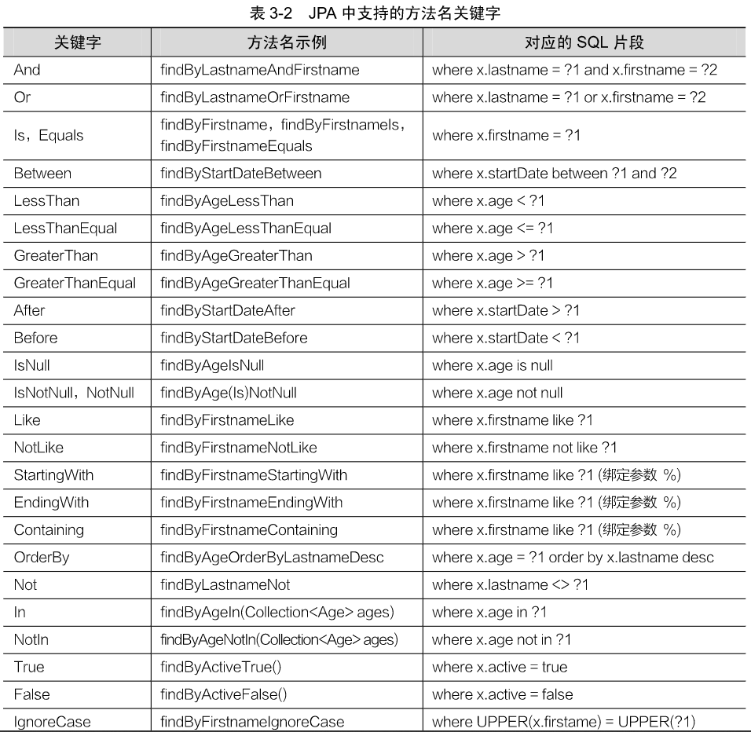

## `Spring Data JPA`介绍

​	`Spring Data JPA`是`Spring`在`ORM`框架、`JPA`规范的基础上封装的一套`JPA`应用框架，它提供了增删改查等常用功能，使开发者可以用较少的代码实现数据操作，同时还易于扩展。

### 1、编写实体类

​	`Spring Data JPA`框架是针对具有`ORM`关系的数据进行操作，所以在使用`Spring Data JPA`时，首先需要编写一个实体类与数据表进行映射，并且配置好映射关系，代码如下：

```java
@Data
@Entity(name = "t_comment")
public class Discuss {
    @Id
    @GeneratedValue(strategy = GenerationType.IDENTITY)
    private Integer id;
    private String content;
    private String author;
    @Column(name = "a_id")
    private Integer aId;
}
```

​	上面代码定义了一个`Spring Data JPA`实体类`Discuss`，并将该类与数据表`t_comment`进行映射，下面针对上述代码用到的注解进行简要说明，如下：

1. `@Entity`：标注要与数据库做映射的实体类，默认情况下，数据表的名称就是首字母小写的类名。当然，还可以使用`name`属性指定映射的表名。
2. `@Id`：标注在类属性或者`getter`方法上，表示某一个属性对应表中的主键。
3. `@GeneratedValue`：与`@Id`注解标注在同一位置，用于表示属性对应主键的生成策略，可省略。`Spring Data JPA`支持的主键生长策略包括有`TABLE`（使用一个特定的数据库表格来保存主键）、`SEQUENCE`（不支持主键自增长的数据库主键生长策略）、`IDENTITY`（主键自增）和`AUTO`（`JPA`自主选择前面3种合适的策略，是默认选项）。
4. `@Column`：标注在属性上，当类属性与表字段不同时，能够配合`name`属性表示类属性对应的表字段名。

### 2、编写`Repository`接口

​	针对不同的表数据操作编写各自对应的`Repository`接口，并根据需要编写对应的数据操作方法，代码如下：

```java
public interface DiscussRepository extends JpaRepository<Discuss, Integer> {
    public List<Discuss> findByAuthorNotNull();
    @Query(value = "SELECT c FROM t_comment c WHERE c.aId = ?1")
    public List<Discuss> getDiscussPaged(Integer aid, PageRequest pageable);
    @Query(value = "SELECT * FROM t_comment WHERE a_id = ?1", nativeQuery = true)
    public List<Discuss> getDiscussPaged2(Integer aid, Package pageable);
    @Transactional
    @Modifying
    @Query("UPDATE t_comment c SET c.author = ?1 WHERE c.id = ?2")
    public int updateDiscuss(String author, Integer id);
    @Transactional
    @Modifying
    @Query("DELETE FROM t_comment c WHERE c.id = ?1")
    public int deleteDiscuss(Integer id);
}
```

​	相关介绍：

1. `findByAuthorNotNull()`方法：该方法是一个基本的查询方法，上面没有任何注解，属于`JPA`支持的方法名关键字查询方式；同时更过定义的方法名可以猜出，该方法的作用是查新`author`费控的`Discuss`评论信息。
2. `getDiscussPaged()`方法；该方法上方通过`Query`注解引入了一个`SQL`语句，用于通过文章分页`ID`查询`Discuss`评论信息。
3. `getDiscussPaged2()`方法：该方法的功能与`getDiscussPaged()`基本类似，区别是该方法上方的`@Query`注解将`nativeQuery`属性设置为`true`(默认`false`)，用来编写原生`SQL`语句。
4. `updateDiscuss()`方法和`deleteDiscuss()`方法：这两个方法同样使用`@Query`注解配置了对应的`SQL`语句，这两个方法分别对应数据的更新和删除操作；需要说明的是，数据更新或者删除操作的方法上还是用了`@Modifying`和`@Transactional`注解，其中，`@Modifying`表示支持数据变更，`@Transactional`表示支持事务管理。

下面我们针对编写`Spring Data JPA`的`Repository`接口方法时需要注意的问题进行重点说明。

1. 使用`Spring Data JPA`自定义接口`Repository`接口，必须继承`XXRepository<T,ID>`接口，其中的`T`代表要操作的实体类，`ID`代表实体类主键数据类型。在上面示例中，选择继承了`JpaRepository`接口，继承结构如下：

   

   - `Repository`是`Spring Data JPA`提供的用于自定义`Repository`接口的顶级父类接口，该接口中没有声明任何方法。
   - `CurdRepository`接口是`Repository`的继承接口之一，包含了一些基本的`CRUD`方法。
   - `PagingAndSortingRepository`接口继承`CurdRepository`接口的同时，提供了分页和排序两个方法。
   - `QueryByExampleExecutor`接口是进行条件封装查询的顶级父接口，允许通过`Example`实例执行复杂条件查询。

   `JpaRepository`接口同时继承了`PagingAndSortingRepository`接口的`QueryByExampleExecutor`接口，并额外提供了一些数据操作方法。自定义`Repository`接口文件时，通常会直接选择继承`JpaRepository`接口。

2. 在使用`Spring Data JPA`进行数据操作时，可以有多种实现方式，主要如下：

   - 如果自定义接口继承了`JpaRepository`接口，则默认包含了一些常用的`CRUD`方法。
   - 自定义`Repository`接口中，可以使用`@Query`注解配合`SQL`语句进行数据的查、改、删操作。
   - 自定义`Repository`接口中，可以直接使用方法名关键字进行查询操作。

   其中，`Spring Data JPA`中支持的方法名关键字及对应的`SQL`片段说明，如下表：

   


3. 在自定义的`Repository`接口中，针对数据的变更操作（修改、删除），无论是否使用了`@Query`注解，都必须在方法上方添加`@Transactional`注解进行事务管理，否则程序执行就会出现`InvalidDataAccessApiUsageException`异常。如果在调用`Respository`接口方法的业务层`Service`类上已经添加了`@Transactional`注解。

4. 在自定义的`Repository`接口中，使用`@Query`注解方式执行数据变更操作（修改、删除），除了要使用`@Query`注解，还必须添加`@Modifying`注解表示数据变更。

5. `JPA`还支持使用`Example`实例进行复杂条件查询，代码如下：

   ```java
   // 使用Example精确匹配查询条件
   Discuss discuss = new Discuss();
   discuss.setAuthor("张三");
   Example<Discuss> example = Example.of(discuss);
   List<Discuss> list = repository.findAll(example);
   // 使用ExampleMatcher模糊匹配查询条件
   Discuss discuss = new Discuss();
   discuss.setAuthor("张");
   ExampleMatcher matcher = ExampleMatcher.matching().withMatcher("author", startsWith());
   Example<Discuss> example = Example.of(discuss, matcher);
   List<Discuss> list = repository.findAll(example);
   ```

   > 注意：代码中中文的编码格式，要与数据库中的编码格式一致，个人推荐字体编码`UTF-8`。


## `SpringBoot`整合`JPA`

步骤如下：

1. 添加依赖启动器，代码如下：

   ```xml
   <dependency>
   	<groupId>org.springframework.boot</groupId>
   	<artifactId>spring-boot-starter-data-jpa</artifactId>
   </dependency>
   ```

   ​	`SpringBoot`对`Spring Data JPA`版本号进行了统一管理。

2. 编写实体类。代码如下：

   ```java
   import lombok.Data;
   import javax.persistence.*;
   
   @Data
   @Entity(name = "t_comment")
   public class Discuss {
       @Id
       @GeneratedValue(strategy = GenerationType.IDENTITY)
       private Integer id;
       private String content;
       private String author;
       @Column(name = "a_id")
       private Integer aId;
   }
   ```

3. 编写`Repository`接口。在`com.learn.mapper`包下，创建一个用于对数据库表`t_comment`进行操作的`Repository`接口`DiscussRepository`，并编写对数据表`t_comment`进行查、改、删操作方法，代码如下：

   ```java
   import com.kanghua.bean.Discuss;
   import org.springframework.data.jpa.repository.JpaRepository;
   import org.springframework.data.jpa.repository.Modifying;
   import org.springframework.data.jpa.repository.Query;
   import org.springframework.transaction.annotation.Transactional;
   
   import java.util.List;
   
   public interface DiscussRepository extends JpaRepository<Discuss, Integer> {
       // 1、查询author费控的Discuss评论集合
       public List<Discuss> findByAuthorNotNull();
   
       // 2、根据文章id分页查询Discuss评论集合
       @Query(value = "SELECT c from t_comment c where c.aId = ?1")
       public List<Discuss> getDiscussPaged(Integer aid, Package pageable);
       
       // 3、使用元素SQL语句，根据文章id分页查询Discuss评论集合
       @Query(value = "SELECT * from t_comment where a_id = ?1", nativeQuery = true)
       public List<Discuss> getDiscussPaged2(Integer aid, Package pageable);
       
       // 4、根据评论id修改评论作者author
       @Transactional
       @Modifying
       @Query("update t_comment c set c.author = ?1 where c.id = ?2")
       public int updateDiscuss(String author, Integer id);
       
       // 5、根据评论id删除评论
       @Transactional
       @Modifying
       @Query("delete t_comment c where c.id = ?1")
       public int deleteDiscuss(Integer id);
   }
   ```

4. 编写单元测试进行接口方法测试。代码如下：

   ```java
   import static org.springframework.data.domain.ExampleMatcher.GenericPropertyMatchers.startsWith;
   ...
   
   @RunWith(SpringRunner.class)
   @SpringBootTest
   public class JpaTests {
       @Autowired
       private DiscussRepository repository;
   
       // 1、使用JpaRepository内部方法进行数据操作
       @Test
       public void selectComment(){
           Optional<Discuss> optional = repository.findById(1);
           optional.ifPresent(System.out::println);
           System.out.println();
       }
   
       // 2、使用方法名关键字进行数据操作
       @Test
       public void selectCommentByKeys(){
           List<Discuss> list = repository.findByAuthorNotNull();
           System.out.println(list);
       }
   
       // 3、使用@Query注解进行数据操作
       @Test
       public void selectCommentPaged(){
           PageRequest pageable = PageRequest.of(0, 3);
           List<Discuss> allPaged = repository.getDiscussPaged(1, pageable);
           System.out.println(allPaged);
       }
   
       // 4、使用Example封装参数进行数据查询操作
       @Test
       public void selectCommentByExample(){
           Discuss discuss = new Discuss();
           discuss.setAuthor("张三");
           Example<Discuss> example = Example.of(discuss);
           List<Discuss> list = repository.findAll(example);
           System.out.println(list);
       }
       @Test
       public void selectCommentByExampleMatcher(){
           Discuss discuss = new Discuss();
           discuss.setAuthor("张");
           ExampleMatcher matcher = ExampleMatcher.matching().withMatcher("author", startsWith());
           Example<Discuss> example = Example.of(discuss, matcher);
           List<Discuss> list = repository.findAll(example);
           System.out.println(list);
       }
   
   }
   ```

   ​	上面代码中，使用注入的`DiscussRepository`实例对象编写了多个单元测试方法针对`DiscussRepository`接口中的方法进行调试测试。通过示例中的代码注释可以看到，测试方法中分别使用了`JpaRepository`默认方法，方法名关键字、`@Query`注解和`Example`封装参数的形式进行了数据操作。

5. 测试。运行测试类中的`selectCommentByExampleMatcher()`方法，即可看到效果。

   ```
   [Discuss(id=4, content=很好，非常详细, author=张三, aId=1), Discuss(id=5, content=很不错, author=张扬, aId=2)]
   ```

   
