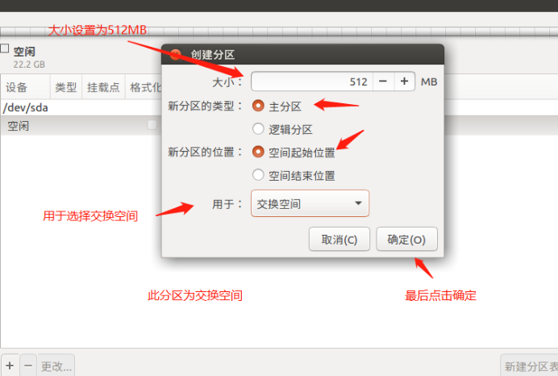
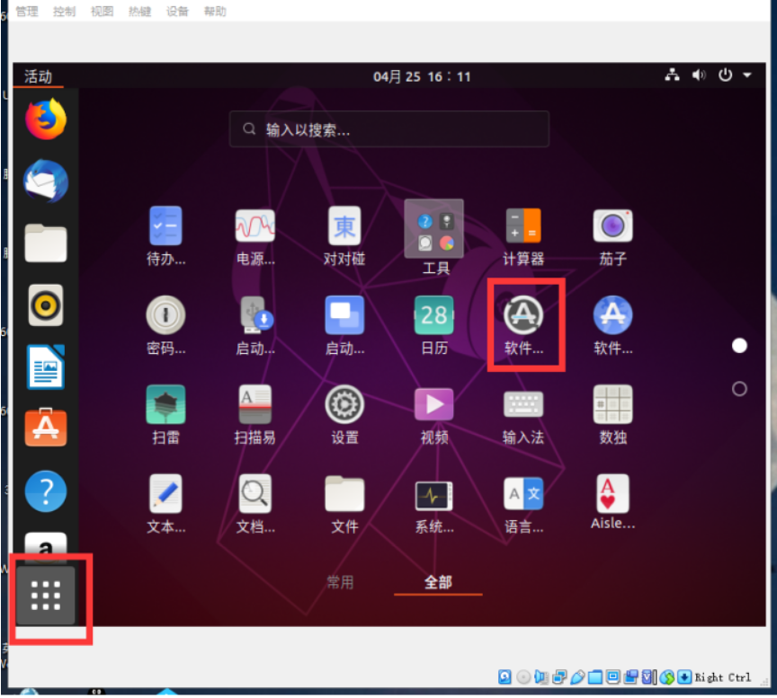
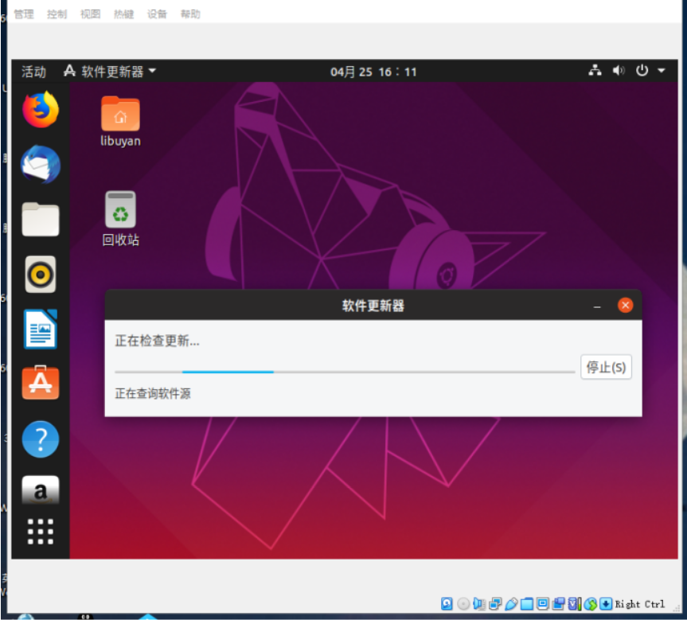
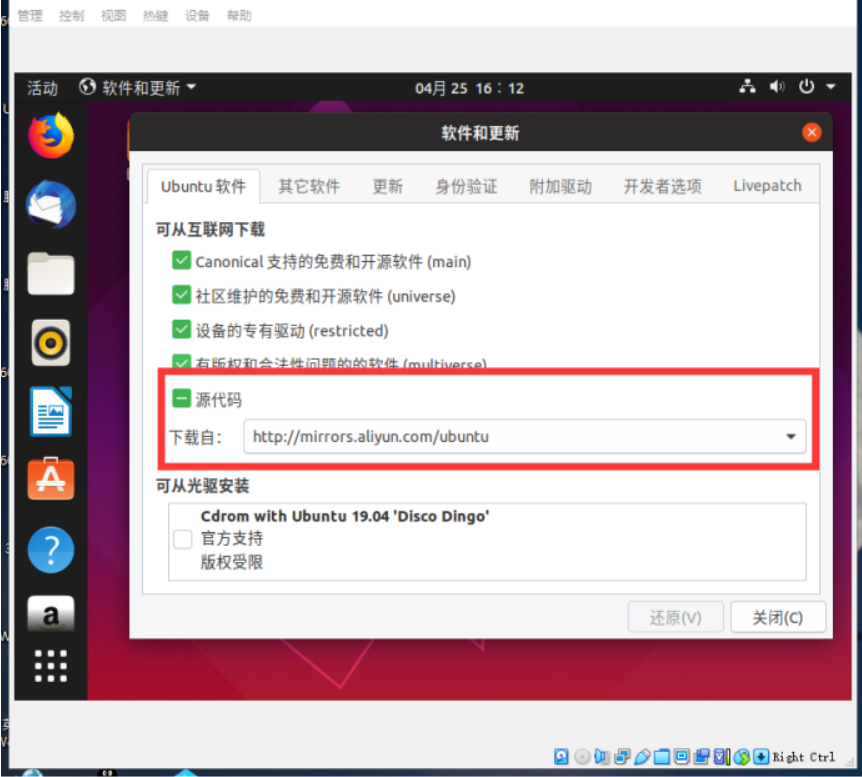
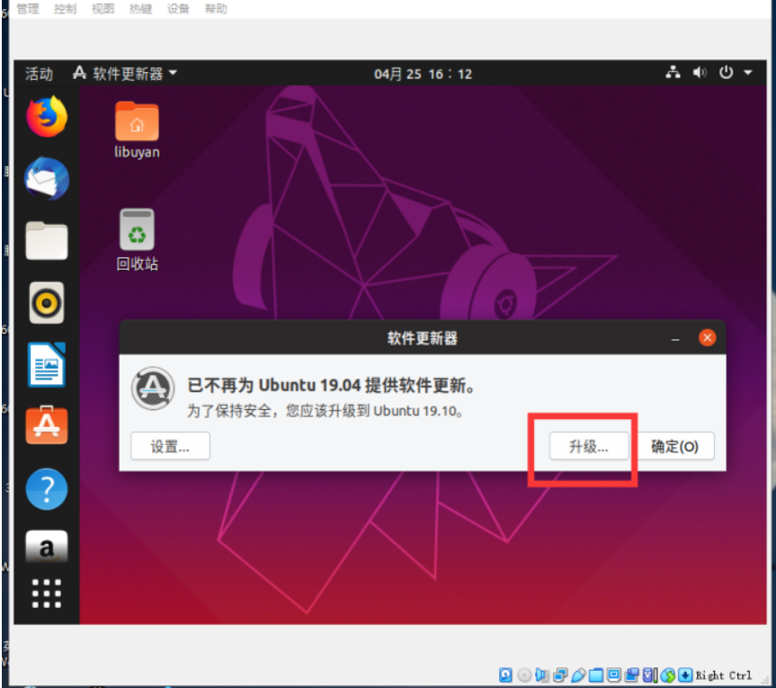
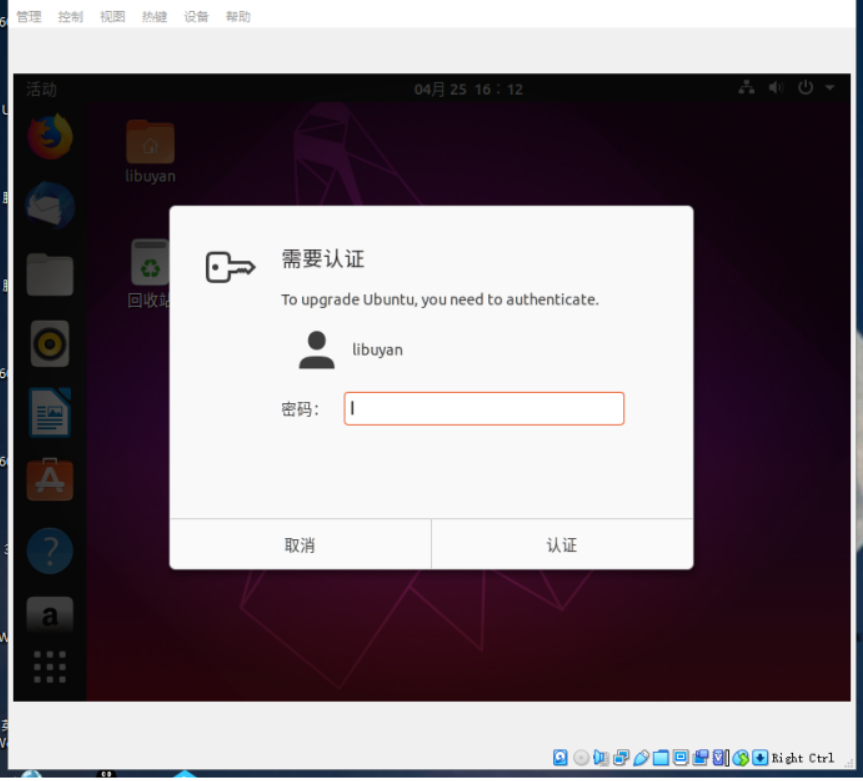
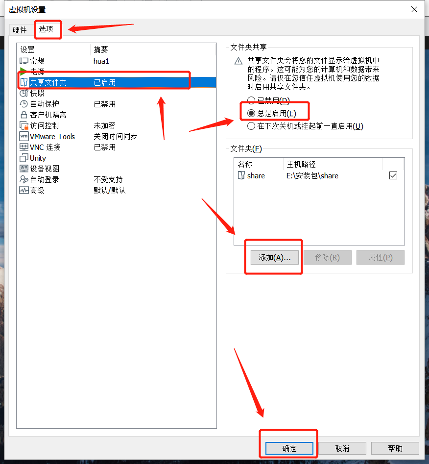
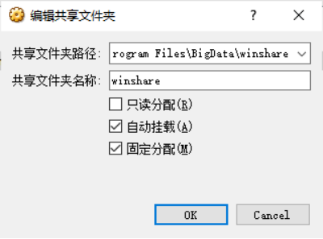
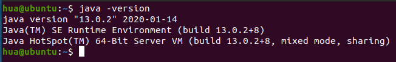
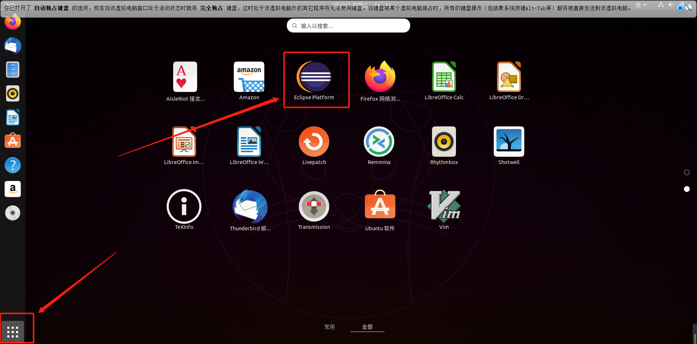

# Ubuntu虚拟机配置

​	前段时间因为被虚拟机搞的头大，所以写个笔记记录一下，以免忘记。

​	环境：Win10系统、Ubuntu19.04镜像、VMware或者Vbox、jdk13.0.2安装包、eclipse安装包

​	开始的时候，我们先打开虚拟机，导入Ubuntu19.04的镜像，这里是基本操作，就不多说了，但是需要注意的一点是：VMware一定要将网络配置成网桥模式，要是实在上不去网，再配置成NAT模式。

​	Vbox直接配置两个网络，第一个网桥，第二个网络地址转换（NAT），内存2G。（要是这样还上不去网，那就可能是宿主机的问题了，我见过的情况的都是宿主机网卡驱动没有安装好。）

​	因为VMware比较简单，以下是Vbox的分区





然后直接安装就可以了

​	等到安装完成，虽然这个时候，可以上网，但是`sudo apt-get update` 和 vim 依然会被和谐，所以我们需要更新一下，升级成19.10版本的，就可以了

升级步骤如下：






​	这里要注意，一定要选择阿里云的镜像，不然很可能不成功







​             	

​	接下来等待就可以了

​	升级完成以后，就可以运行一下这两个命令了，一更新一下源（这个我不知道没必要没有，但是没有后果）：`sudo apt-get update`，第二个命令（安装vim）：`sudo apt-get install vim`

## 	VMware篇

​	接下来安装 VMware tools，请直接参考这篇文章 https://blog.csdn.net/lixinghua666/article/details/82288938

​	先复制到桌面，命令如下：

```bash
cd Desktop/vmware/	# 进入文件夹
tar -zxvf VMwareTools-10.1.6-5214329.tar.gz	# 解压缩
cd vmware-tools-distrib/	#进入这个文件夹
sudo ./vmware-install.pl	# 安装
```

接下来一直按回车，等待安装结束就可以了。

然后设置共享文件夹，用来进行宿主机和虚拟机的文件传输（E:/安装包/share都是自己设置的哈）




​	设置完以后，可以在 Ubuntu 的 `/mnt/hgfs` 里找到，这样我们就可以直接进行宿主机和虚拟机之间的文件传输了

## Vbox篇

​	Vbox需要安装增强功能，点击设备->安装增强功能，安装完成后重新启动下虚拟机即可。

​	然后设置共享文件夹。

​	



​	其中的`D:/program Files/BigData/winshare`是自己设置的。

​	打开终端，使用命令cd /mnt进入到mnt目录，然后使用命令sudo mkdir share创建share文件夹，随后使用命令 `sudo mount -t vboxsf winshare /mnt/share` 挂载共享文件夹，然后我们进入到 share 目录，ls 命令查看，就可以看到我们挂载的文件夹生效了。

​	为了能够实现开机自动挂载，在文件 `/etc/rc.local` 中（用root用户）追加如下命令：`sudo mount -t vboxsf winshare /mnt/share` 放在 exit 0 之前。

## 安装JDK

### 	1、首先先将准备好的jdk安装包cp到虚拟机中

### 	2、 解压到安装目录

一般在 `/usr/local/java` java是自己命名的

解压：

```bash
sudo tar -zxvf jdk-10.0.1_linux-x64_bin.tar.gz -C /usr/local/java/
```

### 	3、配置环境变量

位置一般在 `~/.bashrc` 中

```bash
vim ~/.bashrc
```

在文件的末尾处加上下面的环境变量 ，**注意,不可以修改源文件任何内容。**

格式：

```
export JAVA_HOME=/home/用户名/software/jdk-10.0.1     创建一个java_home的路径
export CLASSPATH=.    java命令查找class文件的路径设置为当前目录
export PATH=$JAVA_HOME/bin:$PATH
```

例如：

```
export JAVA_HOME=/usr/local/java/jdk-13.0.2
export JRE_HOME=${JAVA_HOME}/jre
exportCLASSPATH=.:${JAVA_HOME}/lib:${JRE_HOME}/lib
export PATH=${JAVA_HOME}/bin:$PATH
```

保存并退出。

### 4、刷新环境变量

```bash
source  ~/.bashrc
```

### 5、测试

输入

```bash
java -version
```

出现以下的版本信息，就是安装成功



## 安装eclipse

### 	1、首先先将准备好的eclipse安装包cp到虚拟机中

### 	2、 解压到安装目录

一般在 `/opt` 下面

解压：

```bash
sudo tar -zxvf eclipse-java-2020-03-R-linux-gtk-x86_64.tar.gz -C /opt
```

​	这个时候，我们就已经可以进入到 /opt/eclipse 下，用 ./eclipse 来运行eclipse了

### 3、创建快捷方式	

​	**1、添加桌面图标**

```bash
sudo vim /usr/share/applications/eclipse.desktop
```

​	打开以后，在里面编辑以下的内容

格式

```
[Desktop Entry]
Encoding=UTF-8
Name=Eclipse
Comment=Eclipse
Exec=/绝对路径/eclipse/eclipse
Icon=/绝对路径/eclipse/icon.xpm
Terminal=false
StartupNotify=true
Type=Application
Categories=Application;Development;
```

例如我的配置文件：

```
[Desktop Entry]
Encoding=UTF-8
Name=Eclipse
Comment=Eclipse
Exec=/opt/eclipse/eclipse
Icon=/opt/eclipse/icon.xpm
Terminal=false
StartupNotify=true
Type=Application
Categories=Application;Development;
```

​	**2、给eclipse.desktop文件赋权**

​	用命令：`cd /usr/share/applications/` 进入 `eclipse.desktop` 文件的目录下

​	然后执行命令：`chmod u+x eclipse.desktop` 就完成了赋权

这个时候，我们就可以在这里找到了



​	但是，我们会发现，还是打不开，会报错，找不到java路径，这需要我们建立一个软连接，命令如下：

```bash
cd /opt/eclipse 	# /opt是eclipse的绝对路径
sudo mkdir jre
cd jre
ln -s /usr/local/java/jdk-13.0.2/bin bin	# /usr/local/java/jdk-13.0.2是java安装路径
```

​	这个时候，我们再点击 `eclipse` 的图标，就可以完美运行了。

​	至此，我们虚拟机环境就基本配置完成，小提示：升级过的19.10是自带 python3.7.5 的环境的哦，就不用小伙伴们自己配置了。