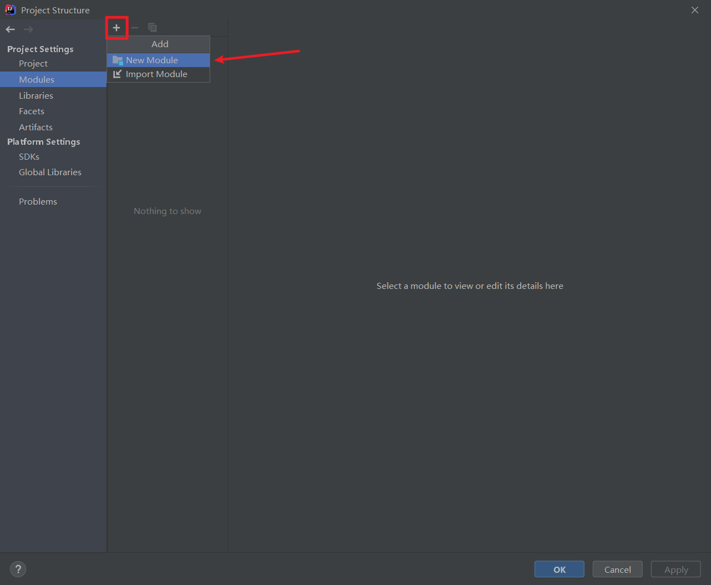
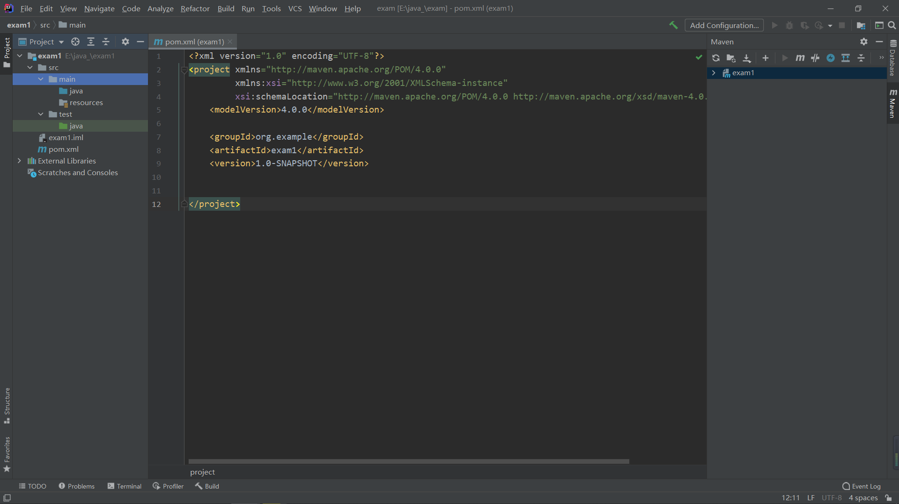
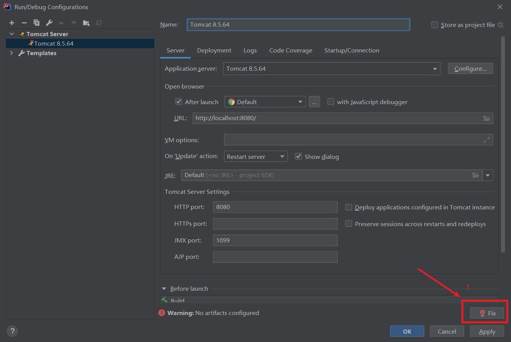
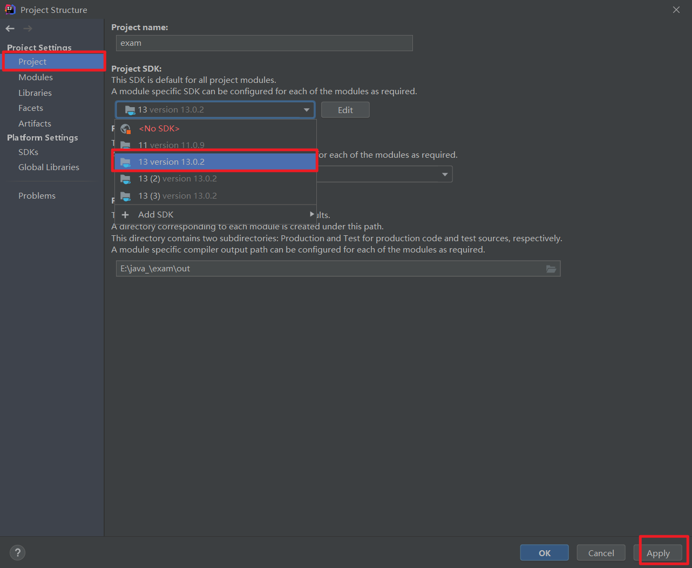
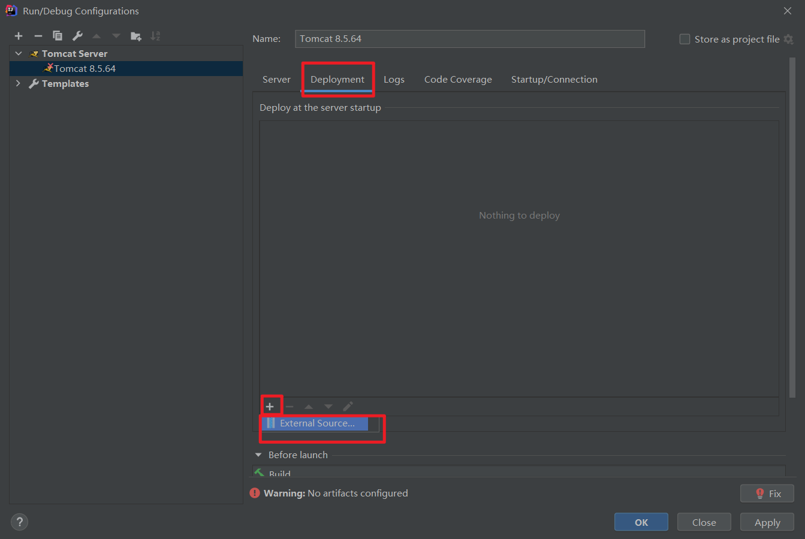
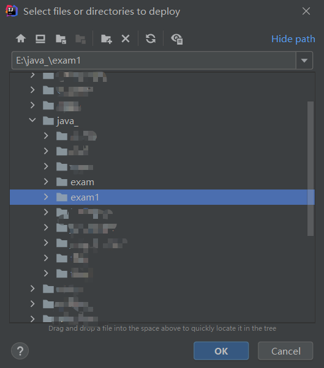
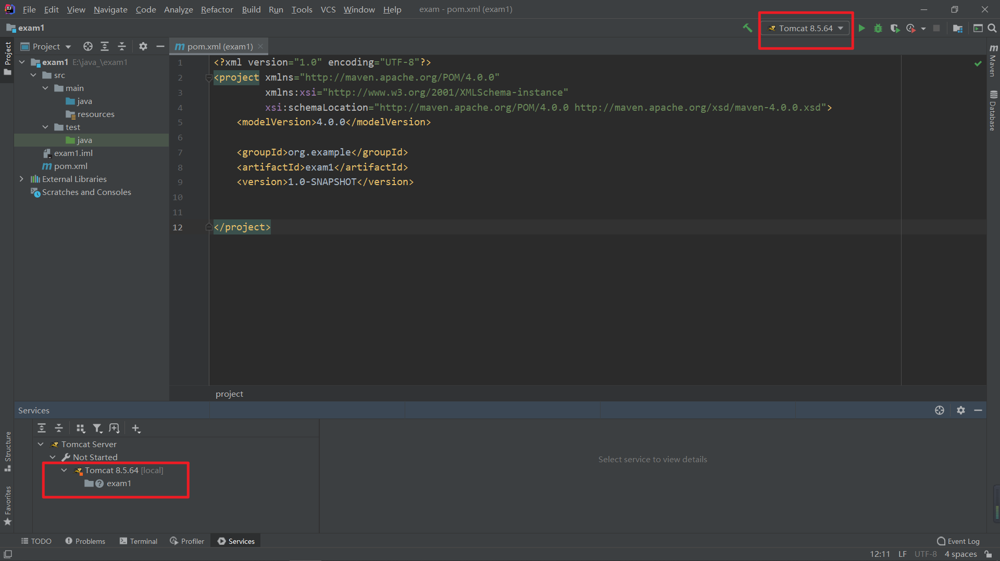
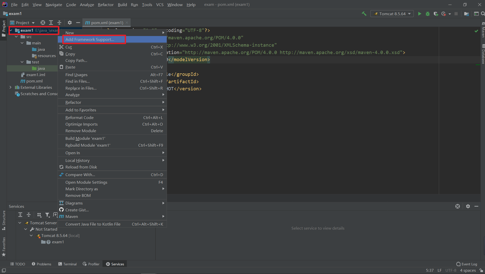
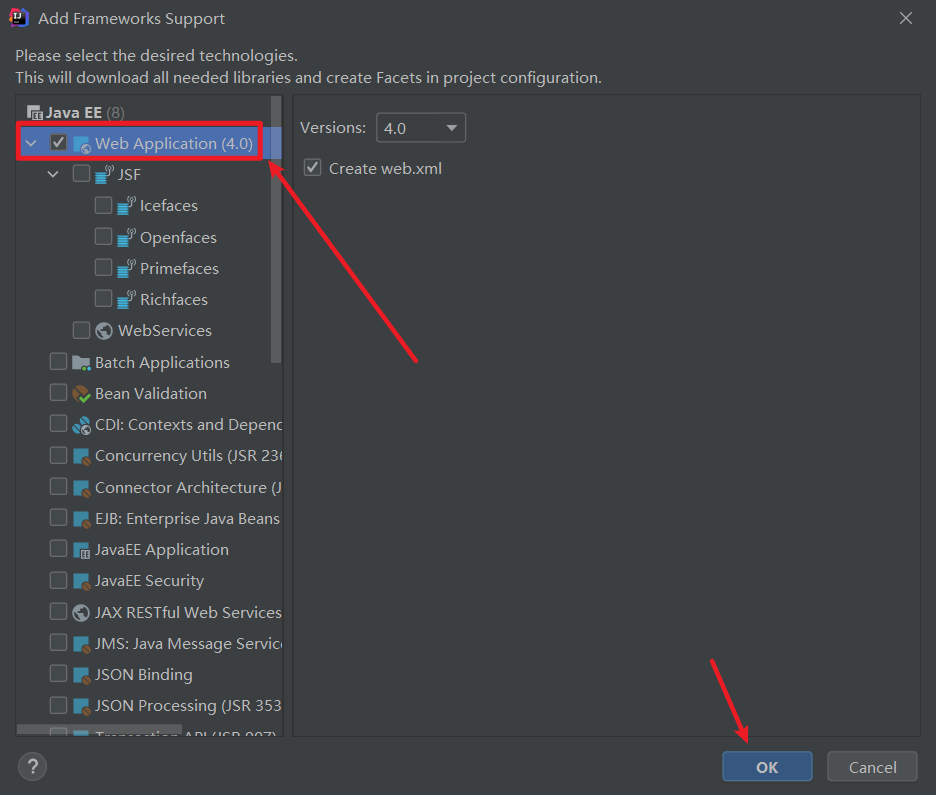
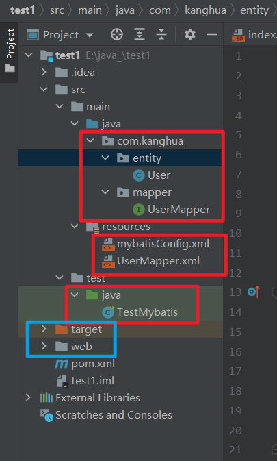

## 第一个 JavaWeb 项目

> 环境：
>
> JDK 版本13.0.2，tomcat 版本8.5.64，maven 版本3.6.3
>
> IDE 版本2020.3.2

​	环境就不说了，tomcat 的环境变量有两个`bin`和`lib`。


​	由于本人是小白，所以从最简单的项目开始，均为小白操作，大佬勿喷。

### 建立项目

​	首先我们先建立一个空的项目，如下：


​	下面我们就需要写项目名了，也就是文件夹的名字，写好项目名以后，会跳出另一个页面，也就是基本配置。

​	如果我们已经有`Module`了，我们可以选择第二个`Import Module`，如果没有，我们可以选择`New Module`。



​	我这里就选择了一个`New Module`，然后就开始配置`maven`环境了。选择`maven`，`next`即可。


​	下面会让填写`New Module`的名字，填写一个 OK 了。（注意：不能跟上面的名字一样，因为上面会新建一个文件夹，这里也会新建一个文件夹，文件夹不可重名。）点击`Final`就可以了。

​	出现下面这个页面就说明我们的`New Module`新建成功了。


​	这时我们点击一下 OK 就好了。

​	到此，我们已经配置好`Module`了。下面就要开始对整个工程配置环境了

### 配置工程环境

​	我们进入以后，整个项目的目录如下：



​	点击一下右上角的`Add Configuration`，然后就可以直接开始配置环境了。










​	然后我们点击一下`OK`就可以了。此时 tomcat 的环境我们已经配置好了，页面如下：



​	还有一个重点，我一开始写好以后，一直运行不成功，就问了一下度娘，配置如下图：

​	右键项目名





​	这样就没问题了。


​	默认各位大佬的`mysql`数据库已经配置好了。

​	sql语句：

```sql
CREATE DATABASE `mybatis_db`;
USE `mybatis_db`;
CREATE TABLE `user` (
`id` int(11) NOT NULL auto_increment,
`username` varchar(32) NOT NULL COMMENT '用户名称',
`birthday` datetime default NULL COMMENT '生日',
`sex` char(1) default NULL COMMENT '性别',
`address` varchar(256) default NULL COMMENT '地址',
    PRIMARY KEY (`id`)
) ENGINE=InnoDB DEFAULT CHARSET=utf8;
-- insert....
insert into `user`(`id`,`username`,`birthday`,`sex`,`address`) values 
(1,'子慕','2020-11-11 00:00:00','男','北京海淀'),
(2,'应颠','2020-12-12 00:00:00','男','北京海淀');

```

​	下面就是建立包，建立`java`文件，配置文件怎么写，话不多说，直接上图：



​	红色框里的都是新建的，蓝色框是运行后出现的，少什么新建什么。

​	直接放代码：

​	pom.xml 文件：

```xml
<?xml version="1.0" encoding="UTF-8"?>
<project xmlns="http://maven.apache.org/POM/4.0.0"
         xmlns:xsi="http://www.w3.org/2001/XMLSchema-instance"
         xsi:schemaLocation="http://maven.apache.org/POM/4.0.0 http://maven.apache.org/xsd/maven-4.0.0.xsd">
    <modelVersion>4.0.0</modelVersion>

    <groupId>org.example</groupId>
    <artifactId>test1</artifactId>
    <version>1.0-SNAPSHOT</version>

    <properties>
        <maven.compiler.source>13</maven.compiler.source>
        <maven.compiler.target>13</maven.compiler.target>
    </properties>

    <dependencies>
        <dependency>
            <groupId>mysql</groupId>
            <artifactId>mysql-connector-java</artifactId>
            <version>8.0.19</version>
        </dependency>
        <dependency>
            <groupId>org.mybatis</groupId>
            <artifactId>mybatis</artifactId>
            <version>3.5.3</version>
        </dependency>
        <dependency>
            <groupId>junit</groupId>
            <artifactId>junit</artifactId>
            <version>4.12</version>
            <scope>test</scope>
        </dependency>
    </dependencies>


</project>
```


​	User 文件：

```java
package com.huafire.entity;
import java.util.Date;
import java.util.List;

public class User {
    private int id;
    private String username;
    private Date birthday;
    private char sex;
    private String address;

    @Override
    public String toString() {
        return "User{" +
                "id=" + id +
                ", username='" + username + '\'' +
                ", birthday=" + birthday +
                ", sex=" + sex +
                ", address='" + address + '\'' +
                '}';
    }

    public int getId() {
        return id;
    }

    public void setId(int id) {
        this.id = id;
    }

    public String getUsername() {
        return username;
    }

    public void setUsername(String username) {
        this.username = username;
    }

    public Data getBirthday() {
        return birthday;
    }

    public void setBirthday(Date birthday) {
        this.birthday = birthday;
    }

    public char getSex() {
        return sex;
    }

    public void setSex(char sex) {
        this.sex = sex;
    }

    public String getAddress() {
        return address;
    }

    public void setAddress(String address) {
        this.address = address;
    }
}

```


​	UserMapper 文件：

```java
package com.huafire.mapper;

import com.huafire.entity.User;

import java.util.List;

public interface UserMapper {
    List<User> findAll();
}

```


​	mybatisConfig.xml 文件：

```xml
<?xml version="1.0" encoding="UTF-8" ?>
<!DOCTYPE configuration
        PUBLIC "-//mybatis.org//DTD Config 3.0//EN"
        "http://mybatis.org/dtd/mybatis-3-config.dtd">
<configuration>
    <environments default="mysql">
        <environment id="mysql">
            <transactionManager type="JDBC"></transactionManager>
            <dataSource type="POOLED">
                <property name="driver" value="com.mysql.cj.jdbc.Driver"/>
                <property name="url" value="jdbc:mysql://local:3306/mybatis_db"/>
                <property name="username" value="root"></property>
                <property name="password" value="123456"></property>
            </dataSource>
        </environment>
    </environments>
    <mappers>
        <mapper resource="UserMapper.xml"/>
    </mappers>
</configuration>
```


​	UserMapper.xml文件：

```xml
<?xml version="1.0" encoding="UTF-8" ?>
<!DOCTYPE mapper
        PUBLIC "-//mybatis.org//DTD Mapper 3.0//EN"
        "http://mybatis.org/dtd/mybatis-3-mapper.dtd">

<mapper namespace="com.huafire.mapper.UserMapper">
    <select id="findAll" resultType="com.huafire.entity.User">
        SELECT * FROM user
    </select>

</mapper>
```


​	TestMybatis 文件：

```java
import com.huafire.entity.User;
import com.huafire.mapper.UserMapper;
import org.apache.ibatis.io.Resources;
import org.apache.ibatis.session.SqlSession;
import org.apache.ibatis.session.SqlSessionFactory;
import org.apache.ibatis.session.SqlSessionFactoryBuilder;
import org.junit.Test;

import java.io.IOException;
import java.io.InputStream;
import java.util.List;

public class TestMybatis {
    @Test
    public void test(){

        try {
            InputStream is = Resources.getResourceAsStream("mybatisConfig.xml");

            SqlSessionFactory sqlSessionFactory = new SqlSessionFactoryBuilder().build(is);

            SqlSession sqlSession = sqlSessionFactory.openSession();

            UserMapper maper = sqlSession.getMapper(UserMapper.class);

            List<User> all = maper.findAll();

            for (User user : all) {
                System.out.println(user);
            }

        } catch (IOException e) {
            e.printStackTrace();
        }

    }
}

```

​	运行以后，会自动生成一个`index.jsp`，里面就是前端了。

​	踩过的坑会专门整理成一篇文章的哦~

​	传送门在这里哦---->[`javaWeb踩坑记`](https://likanghua.gitee.io/posts/d0300bea.html)

